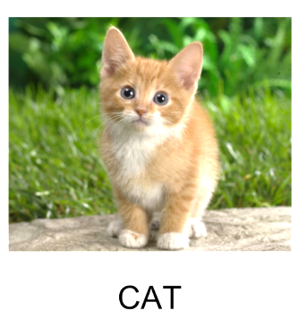
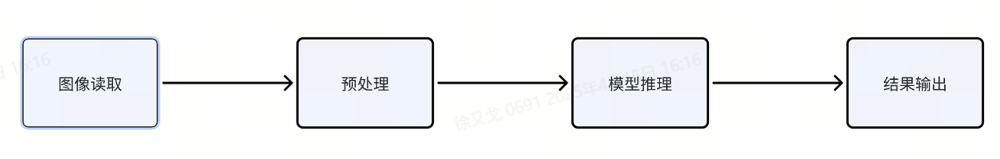
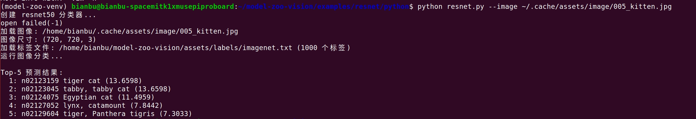
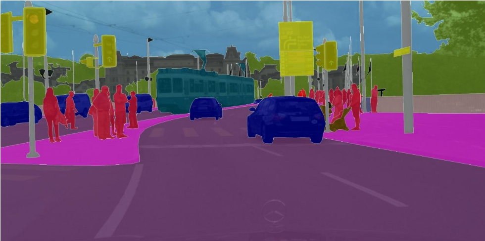
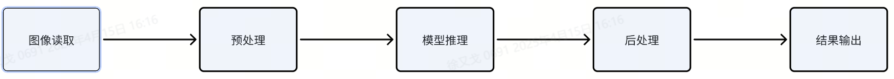
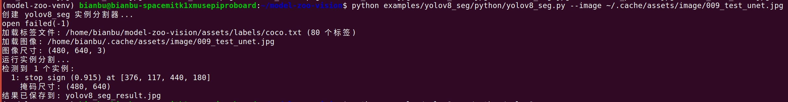
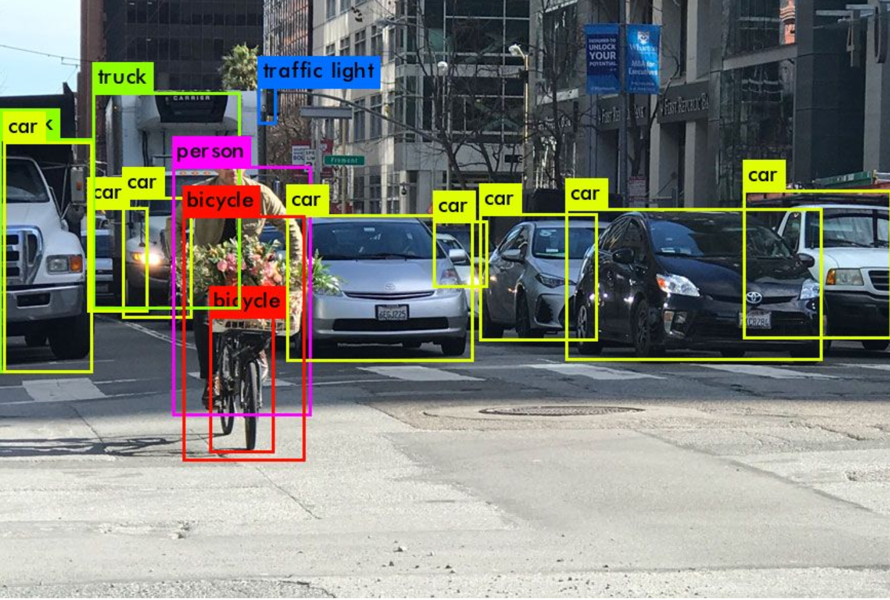
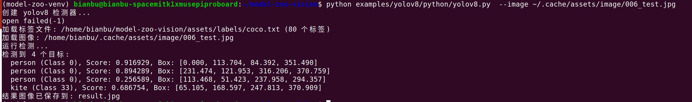

> 以VISION组件为例介绍进迭时空Model Zoo的基础模块使用说明，可供开发者参考。

# 1. 环境安装

### 1.1 系统环境依赖安装

```
# 系统依赖示例（Linux）
sudo apt-get update
sudo apt-get install -y python3-venv
sudo apt-get install -y python3-spacemit-ort opencv-spacemit
sudo apt-get install -y libeigen3-dev
```

### 1.2 下载代码

```
cd ~
git clone https://github.com/spacemit-robotics/model-zoo-vision.git
```

### 1.3 python环境依赖安装

设置python pip源：

```bash
pip config set global.index-url https://pypi.tuna.tsinghua.edu.cn/simple
pip config set global.extra-index-url https://git.spacemit.com/api/v4/projects/33/packages/pypi/simple
```

创建虚拟环境：

```
python3 -m venv ~/model-zoo-venv
source ~/model-zoo-venv/bin/activate
```

在虚拟环境中安装python依赖：

```
pip install numpy==2.2.4
pip install onnxruntime
pip install spacemit-ort
pip install opencv-python
pip install pillow
pip install PyYAML
```

# 2. 下载模型和资源

### 2.1 下载模型

模型统一放在 **`~/.cache/models/vision/<type>/`**（如 `~/.cache/models/vision/yolov8/`）。若运行示例时提示「Model file not found」，请在对应示例目录下执行下载脚本：

```
# 下载example/yolov8所需要的模型
bash ~/model-zoo-vision/examples/yolov8/scripts/download_models.sh
```

也可以一键下载所有示例/应用所需模型（在 vision 组件根目录执行）：

```
bash ~/model-zoo-vision/scripts/download_all_models.sh
```

全部下载完成后模型如下：

```
bianbu@bianbu-spacemitk1xmusepiproboard:~/.cache/models/vision# tree
.
├── arcface
│   └── arcface_mobilefacenet_cut.q.onnx
├── ocsort
│   ├── ocsort_yoloxs_sim.onnx
│   └── yolov8n.q.onnx
├── resnet
│   ├── emotion_resnet50_final.q.onnx
│   └── resnet50.q.onnx
├── stgcn
│   └── stgcn.onnx
├── yolov11
│   ├── yolo11m.q.onnx
│   ├── yolo11n.q.onnx
│   └── yolo11s.q.onnx
├── yolov5
│   └── yolov5_gesture.q.onnx
├── yolov5-face
│   └── yolov5n-face_cut.q.onnx
├── yolov8
│   ├── yolov8_fire.q.onnx
│   ├── yolov8m.q.onnx
│   ├── yolov8n.q.onnx
│   └── yolov8s.q.onnx
├── yolov8_pose
│   ├── yolov8m-pose.q.onnx
│   ├── yolov8n-pose.q.onnx
│   └── yolov8s-pose.q.onnx
└── yolov8_seg
    ├── yolov8m-seg.q.onnx
    ├── yolov8n-seg.q.onnx
    └── yolov8s-seg.q.onnx
```

### 2.2 下载资源

示例与应用的默认测试图片、视频统一从 **`~/.cache/assets/`** 读取。首次使用可执行：

```
bash ~/model-zoo-vision/scripts/download_assets.sh
```

脚本会从 `https://archive.spacemit.com/spacemit-ai/model_zoo/assets/` 下载 `image`、`video` 等目录到 `~/.cache/assets`（与服务器目录名一致）。配置中默认路径为 `~/.cache/assets/image/`、`~/.cache/assets/video/`。

```
bianbu@bianbu-spacemitk1xmusepiproboard:~/.cache/assets# tree
.
├── image
│   ├── 001_emotion.jpg
│   ├── 002_fire.jpg
│   ├── 003_face0.png
│   ├── 004_face1.png
│   ├── 005_kitten.jpg
│   ├── 006_test.jpg
│   ├── 007_dog.jpg
│   ├── 008_picture.jpg
│   └── 009_test_unet.jpg
└── video
    ├── 001_crowd.mp4
    ├── 002_fall.mp4
    └── 003_palace.mp4
```

各示例的配置文件与默认路径见各模型子目录 README（如 `examples/yolov8/README.md`、`examples/arcface/README.md`）。

# 3. 模型使用说明

## 3.1 图像分类

### 3.1.1 简介

图像分类（Image Classification）是计算机视觉领域中的一个基本问题，其目标是根据图像的内容给图像分配一个或多个预定义的类别标签。

<center>
    
    <br>
</center>

### 3.1.2 常见模型

常见的图像分类模型包括resnet50、vgg16等。

### 3.1.3 图像分类流程 

图像分类的一般流程如下图所示：

<center>
    
    <br>
</center>
- **预处理**：对输入图像进行标准化、调整大小、数据增强等操作，以便于输入到神经网络中，提升模型的训练效果和推理精度。
- **模型推理**：将预处理后的图像送入已经训练好的模型中，进行前向传播计算并输出预测结果。

### 3.1.4 API简介

我们对图像分类的关键步骤封装进行封装，用户只需调用封装后的API函数，即可快速达到处理目标。

#### 读取图像

读取图像的API函数如下，`image_path` 为具体的图片路径，可以是相对路径或者绝对路径。

```python
img = get_image(image_path)
```

#### 预处理

图像预处理的API函数如下，`img` 为调用 `get_image` 后的结果。

```python
img = preprocess(img)
```

#### 推理

模型推理的API函数如下，`model_path` 为模型路径，`img` 为调用预处理后的结果。

```python
result = inference(model_path, img)
```

### 3.1.5 快速开始

以resnet模型为例，执行下述令调用resnet50.q.onnx模型进行图像分类：

```shell
source ~/model-zoo-venv/bin/activate
cd ~/model-zoo-vision
bash examples/resnet/scripts/download_models.sh
python examples/resnet/python/resnet.py --image ~/.cache/assets/image/005_kitten.jpg
```

`resnet.py` 脚本支持参数有：

-  `--model-path model_path`：指定特定模型路径
- `--image image_path`：指定目标推理图片路径

执行结果如下图：

<center>
    
    <br>
</center>

## 3.2 图像分割

### 3.2.1 简介

图像分割是计算机视觉中的一个关键任务，其目标是将一幅图像划分成多个部分或区域，每个部分通常对应着某个特定的对象或者场景的一部分。图像分割可以被看作是对图像内容的一种详细理解方式，它不仅识别图像中有什么（如分类任务），还指出它们在哪里以及它们的精确边界。

<center>
    
    <br>
</center>
### 3.2.2 常见模型

常见的图像分类模型包括FCN，Unet，YOLOv8-seg等。

### 3.2.3 图像分割流程 

图像分割的一般流程如下图所示：

<center>
    
    <br>
</center>
- **后处理**：在模型推理阶段之后，对模型输出结果进行的一系列操作，目的是优化结果，增强模型输出的准确性、可用性和可解释性。

### 3.2.4 API简介

#### 预处理

图像预处理的API函数如下，`img` 为 `cv2.imread` 的结果。

```python
img = preprocess(img)
```

#### 推理

模型推理API函数如下所示，`model_path` 为具体的模型路径，`img` 为调用预处理后的结果。

```python
outputs = inference(args.model,img)
```

#### 后处理

对推理结果后处理的API函数如下所示，`outputs` 为推理结果。

```python
res = postprocess(outputs)
```

### 3.2.5 快速开始

以FCN模型为例，执行下述令调用yolov8-seg.q.onnx模型进行图像分割：

```shell
source ~/model-zoo-venv/bin/activate
cd ~/model-zoo-vision
bash examples/yolov8_seg/scripts/download_models.sh
python examples/yolov8_seg/python/yolov8_seg.py --image ~/.cache/assets/image/009_test_unet.jpg
```

`yolov8_seg.py` 脚本支持参数有：

-  `--model-path model_path`：指定特定模型路径
-  `--image image_path`：指定目标推理图片路径

执行结果如下图：



## 3.3 目标检测

### 3.3.1 简介

目标检测是计算机视觉领域中的一个重要任务，其主要目的是在图像或视频中识别出特定对象的位置及其类别。与图像分类不同，目标检测不仅需要识别图像中存在哪些物体，还需要给出每个物体的具体位置，通常以边界框（bounding box）的形式表示。

<center>
    
    <br>
</center>
### 3.3.2 常见模型

目前比较常用的目标检测模型以YOLO系列为主。

### 3.3.3 目标检测流程 

目标检测的一般流程如下图：

<center>
    
    <br>
</center>

### 3.3.4 API简介

#### 预处理

图像预处理的API函数如下，`frame` 为 `cv2.imread` 或者 `cap.read` 的结果

```python
input_tensor = preprocess(frame)
```

#### Detection类

目标检测类实例化后可调用infer函数进行推理，`model_path` 为模型路径，`input_tensor` 为预处理后的结果。

```python
detector = Detection(model_path)
outputs = detector.infer(input_tensor)
```

#### 后处理

推理结果后处理的API函数如下，`output` 为上一步处理的结果，详见 `yolov8.py`。

```python
dets = postprocess(frame,output, anchors, offset, conf_threshold=args.conf_threshold)
final_dets = nms(dets,iou_threshold=0.45)
```

### 3.3.5 快速开始

以YOLOv8模型为例，执行下述令调用yolov8n.q.onnx模型进行目标检测：

```shell
source ~/model-zoo-venv/bin/activate
cd ~/model-zoo-vision
bash examples/yolov8/scripts/download_models.sh
python examples/yolov8/python/yolov8.py  --image ~/.cache/assets/image/006_test.jpg
```

`yolov8.py` 脚本支持参数有：

-  `--model-path model_path`：指定特定模型路径
-  `--image image_path`：指定目标推理图片路径

执行结果如下图：



