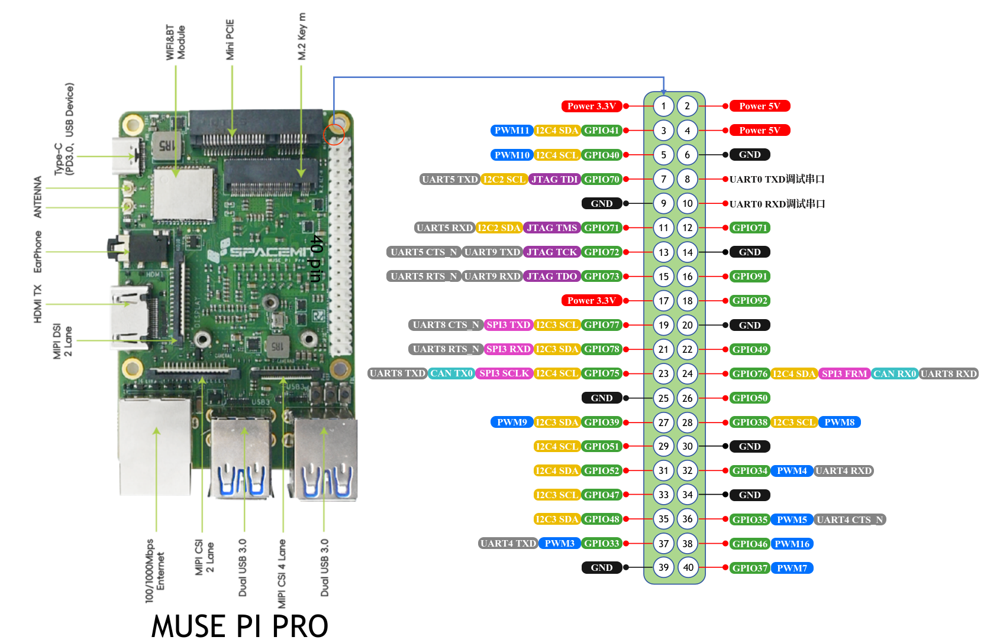
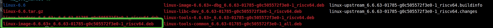
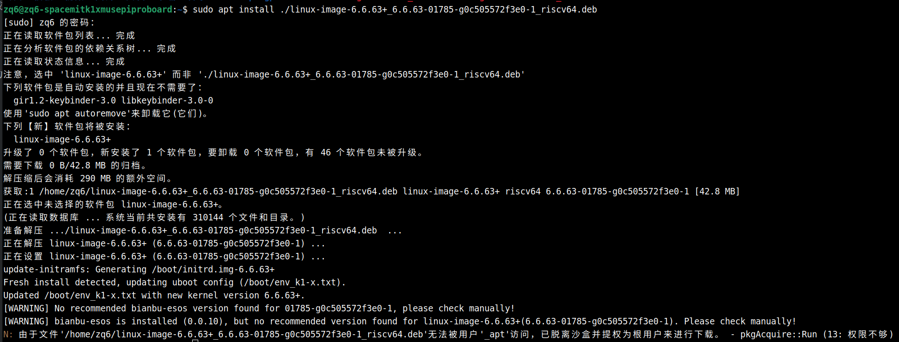
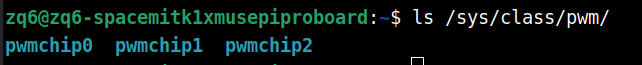
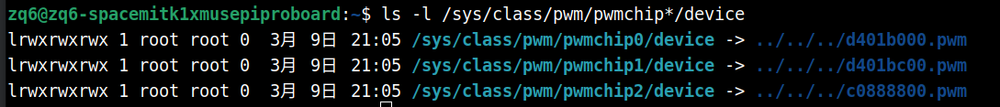
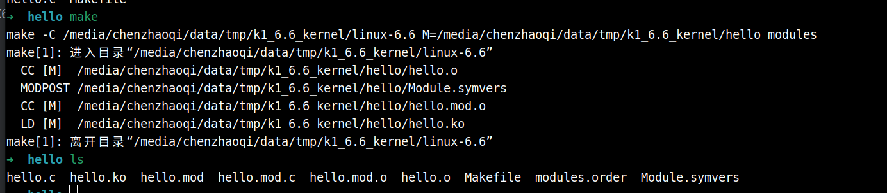
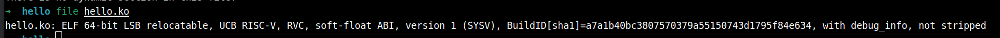
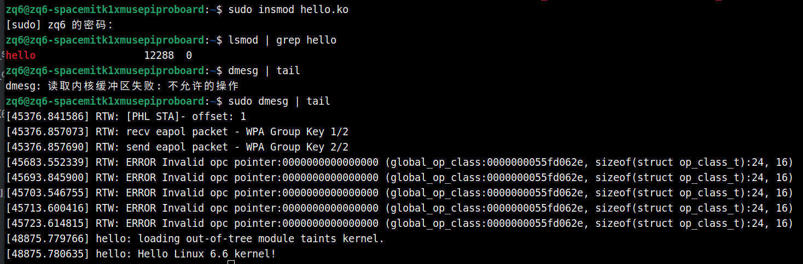
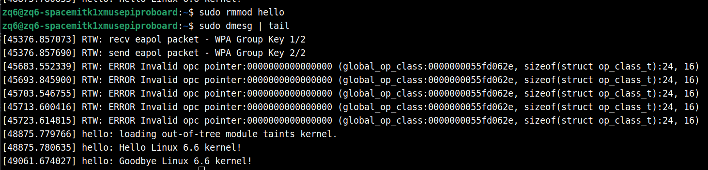

sidebar_position: 14

## 示例说明

本示例展示如何配置设备树开启 Muse Pi Pro 开发板上的硬件 PWM，以及如何从用户层C代码或Python代码使用硬件PWM。

硬件PWM和常用单片机上的PWM一致，可以用于常见舵机的控制，也可用于直流电机调速等。

更多信息请参考：https://www.spacemit.com/community/document/info?lang=zh&nodepath=software/SDK/buildroot/k1_buildroot/device/peripheral_driver

## 软硬件环境要求

- ubuntu22 x64电脑 / ubuntu22 虚拟机，运行内存 > 8GB
- K1 Muse Pi Pro 一块，系统：Bianbu LXQt V2.3

由于涉及交叉编译，下面的操作步骤使用 X64 来标识该操作是在 X64的ubuntu上完成的，使用 K1 标识在 Muse Pi Pro 开发板上完成的，请注意区分。

内核编译的详细教程参考：https://www.spacemit.com/community/document/info?lang=zh&nodepath=software/SDK/bianbu/development/kernel_compile.md

本示例仅展示关键步骤

## 获取内核源码（X64）

安装依赖

```
sudo apt-get install debhelper libpfm4-dev libtraceevent-dev asciidoc libelf-dev devscripts wget
```

下载源码

```
cd ~
wget https://archive.spacemit.com/ros2/code/linux-6.6.tar.gz
tar xzvf linux-6.6.tar.gz
```

源码较大，请保持网络良好

## 下载交叉编译工具链（X64）

下载交叉编译器

```
cd ~
wget https://archive.spacemit.com/toolchain/spacemit-toolchain-linux-glibc-x86_64-v1.0.1.tar.xz
```

解压工具链：

```
sudo tar -Jxf ~/spacemit-toolchain-linux-glibc-x86_64-v1.0.1.tar.xz -C /opt
```

设置交叉编译器环境变量：

```
export PATH=/opt/spacemit-toolchain-linux-glibc-x86_64-v1.0.1/bin:$PATH
```


## 配置PWM设备树（X64）

引脚复用图（一个引脚可以通过设备树配置为不同的功能）



这里以PWM7，即GPIO37作为示例，

Bianbu LXQt V2.3 默认开启了 pwm4，不配置即可使用

### k1-x_pinctrl 确认或配置

找到文件：

```
linux-6.6/arch/riscv/boot/dts/spacemit/k1-x_pinctrl.dtsi
```

搜索 pwm7

```
	pinctrl_pwm7_0: pwm7_0_grp {
		pinctrl-single,pins = <
			K1X_PADCONF(GPIO_92, MUX_MODE2, (EDGE_NONE | PULL_UP | PAD_1V8_DS2))	/* pwm7 */
		>;
	};

	pinctrl_pwm7_1: pwm7_1_grp {
		pinctrl-single,pins =<
			K1X_PADCONF(GPIO_37, MUX_MODE2, (EDGE_NONE | PULL_UP | PAD_1V8_DS2))	/* pwm7 */
		>;
	};
```

有些 pwm 已经配置，可以直接使用，这里确认一下即可，这里的 pinctrl_pwm7_0、pinctrl_pwm7_1 是独立的，表示两种可选的方案，后续可在dts里面选择。

如果遇到没有配置的 pwm, 参考此处配置即可

在本示例中，我们使用的是 pinctrl_pwm7_1 这个配置，即将 pwm 绑定到 GPIO37 引脚

### k1-x.dtsi 确认或配置

定位到文件：

```
linux-6.6/arch/riscv/boot/dts/spacemit/k1-x.dtsi
```

确认或新增 pwm7 的配置

```
		pwm7: pwm@d401bc00 {
			compatible = "spacemit,k1x-pwm";
			reg = <0x0 0xd401bc00 0x0 0x10>;
			#pwm-cells = <1>;
			clocks = <&ccu CLK_PWM7>;
			resets = <&reset RESET_PWM7>;
			k1x,pwm-disable-fd;
			status = "disabled";
		};
```

### dts配置

找到文件：

```
linux-6.6/arch/riscv/boot/dts/spacemit/k1-x_MUSE-Pi-Pro.dts
```

新增 pwm7 如下：

```
&pwm4 {
	pinctrl-names = "default";
	pinctrl-0 = <&pinctrl_pwm4_1>;
	status = "okay";
};

&pwm7 {
	pinctrl-names = "default";
	pinctrl-0 = <&pinctrl_pwm7_1>;
	status = "okay";
};
```

把 status 配置为 okay

pwm4是默认配置好的

注意使用 pinctrl_pwm7_1 这个配置，否则无法在引脚 37 使用 PWM

## 编译内核（X64）

配置完成后编译内核

设置工具链地址：

```
export PATH=/opt/spacemit-toolchain-linux-glibc-x86_64-v1.0.1/bin:$PATH
# 再次确认工具链是否正确
riscv64-unknown-linux-gnu-gcc --version
```

编译出新的内核deb包

```
sudo apt install debhelper libpfm4-dev libtraceevent-dev asciidoc libelf-dev devscripts \
flex bison u-boot-tools
```

```
export ARCH=riscv
export CROSS_COMPILE=riscv64-unknown-linux-gnu-
make k1_defconfig

make -j$(nproc) bindeb-pkg
```

耗时较久，耐心等待

编译产物：



把 linux-image-6.6.63+_6.6.63-01785-g0c505572f3e0-1_riscv64.deb 拷贝到板子上

## 替换内核（K1）

```
sudo apt install ./linux-image-6.6.63+_6.6.63-01785-g0c505572f3e0-1_riscv64.deb
```

终端输出



```
sudo reboot
```

注意不要断电重启，避免系统文件损坏导致系统崩溃

等待重启完成

## 查看是否配置成功（K1）



PWM 子系统会暴露设备节点

运行： `ls -l /sys/class/pwm/pwmchip*/device`



可以看到，pwmchip1 中 d401bc00 与上面 k1-x.dtsi 里面配置的 pwm7 的 reg 字段一样，因此在这里使用 pwmchip1

pwmchip0是pwm4，系统默认开启

pwmchip2 是内核顺带注册，不用管


## Python使用PWM7（K1）

### 服务端

```python
# 以 root 启动
import socket
import os
import time
import json

PWMCHIP = "/sys/class/pwm/pwmchip1" # 这里指定pwm编号
PWM_INDEX = 0 # pwm通道，设置为0即可，无需改动
PWM_BASE = f"{PWMCHIP}/pwm{PWM_INDEX}"

SOCK_PATH = "/run/pwm_control_uds.sock"

def write(path, value):
    with open(path, "w") as f:
        f.write(str(value))

def read(path):
    with open(path, "r") as f:
        return f.read().strip()

def ensure_pwm_exported():
    if not os.path.exists(PWM_BASE):
        write(f"{PWMCHIP}/export", PWM_INDEX)
        for _ in range(20):
            if os.path.exists(PWM_BASE):
                break
            time.sleep(0.05)
        else:
            raise RuntimeError(f"{PWM_BASE} not created")

# ================== PWM 初始化 ==================
ensure_pwm_exported()

period = 1_000_000  # 周期设置为 1,000,000 ns (即 1ms，频率为 1kHz)
enable_path = f"{PWM_BASE}/enable"

if read(enable_path) != "0":
    write(enable_path, 0)

write(f"{PWM_BASE}/period", period)
write(f"{PWM_BASE}/duty_cycle", 0)
write(f"{PWM_BASE}/enable", 1)

# ================== UNIX Domain Socket 服务 ==================
if os.path.exists(SOCK_PATH):
    os.unlink(SOCK_PATH)

srv = socket.socket(socket.AF_UNIX, socket.SOCK_STREAM)
srv.bind(SOCK_PATH)
os.chmod(SOCK_PATH, 0o666)   # 允许普通用户访问
srv.listen(1)

print("PWM UDS server listening:", SOCK_PATH)

while True:
    conn, _ = srv.accept()
    print("client connected")

    while True:
        data = conn.recv(256)
        if not data:
            break   # 客户端断开

        try:
            msg = json.loads(data.decode())
            duty = float(msg.get("duty", 0.0))
            duty = max(0.0, min(1.0, duty))

            write(f"{PWM_BASE}/duty_cycle", int(period * duty))
            resp = {"ok": True}
        except Exception as e:
            resp = {"ok": False, "error": str(e)}

        conn.sendall(json.dumps(resp).encode())

    conn.close()
    print("client disconnected")
```

保存为 pwm_server.py

```
sudo python3 pwm_server.py
```

因为要操作/sys目录，因此需要 root 权限

调整 period 变量即可调整频率

### 客户端

```
import socket
import json

SOCK_PATH = "/run/pwm_control_uds.sock"

sock = socket.socket(socket.AF_UNIX, socket.SOCK_STREAM)
sock.connect(SOCK_PATH)


print("输入 duty (0.0 ~ 1.0)，输入 q 退出")

while True:
    s = input("duty> ").strip()

    if s.lower() in ("q", "quit", "exit"):
        break

    try:
        duty = float(s)
    except ValueError:
        print("错误，请输入数字")
        continue

    if not 0.0 <= duty <= 1.0:
        print("错误，duty 必须在 0.0 ~ 1.0 之间")
        continue

    # REQ → REP：send 后必须 recv
    sock.sendall(json.dumps({"duty": duty}).encode())
    resp = sock.recv(256)

    print("✔ 回复:", json.loads(resp.decode()))

sock.close()
```

保存为 pwm_client.py

```
python3 pwm_client.py
```

可以接一个LED灯，调节占空比实现呼吸灯


## C++ 使用PWM7 （K1）

### 安装依赖

```
sudo apt install nlohmann-json3-dev
```

### 服务端（pwm_server.cpp）

```
#include <iostream>
#include <fstream>
#include <string>
#include <thread>
#include <chrono>
#include <sys/stat.h>
#include <sys/socket.h>
#include <sys/un.h>
#include <unistd.h>
#include <algorithm>

#include "nlohmann/json.hpp"  // JSON 库

using json = nlohmann::json;

const std::string PWMCHIP = "/sys/class/pwm/pwmchip1";
const int PWM_INDEX = 0;
const std::string PWM_BASE = PWMCHIP + "/pwm" + std::to_string(PWM_INDEX);
const std::string SOCKET_PATH = "/run/pwm_cpp.sock";

// ================== 文件操作 ==================
void write_file(const std::string &path, const std::string &value) {
    std::ofstream ofs(path);
    if (!ofs) throw std::runtime_error("Failed to open " + path);
    ofs << value;
}

bool exists(const std::string &path) {
    struct stat st;
    return stat(path.c_str(), &st) == 0;
}

void ensure_pwm_exported() {
    if (!exists(PWM_BASE)) {
        write_file(PWMCHIP + "/export", std::to_string(PWM_INDEX));
        for (int i = 0; i < 20; ++i) {
            if (exists(PWM_BASE)) break;
            std::this_thread::sleep_for(std::chrono::milliseconds(50));
        }
        if (!exists(PWM_BASE))
            throw std::runtime_error(PWM_BASE + " not created");
    }
}

// ================== IPC 服务 ==================
int setup_unix_socket(const std::string &path) {
    int server_fd = socket(AF_UNIX, SOCK_STREAM, 0);
    if (server_fd < 0) throw std::runtime_error("socket() failed");

    // 删除已存在的 socket 文件
    unlink(path.c_str());

    sockaddr_un addr{};
    addr.sun_family = AF_UNIX;
    strncpy(addr.sun_path, path.c_str(), sizeof(addr.sun_path) - 1);

    if (bind(server_fd, (struct sockaddr*)&addr, sizeof(addr)) < 0)
        throw std::runtime_error("bind() failed");

    if (chmod(path.c_str(), 0666) < 0)
        throw std::runtime_error("chmod() failed");

    if (listen(server_fd, 5) < 0)
        throw std::runtime_error("listen() failed");

    return server_fd;
}

double parse_duty(const std::string &msg) {
    try {
        json j = json::parse(msg);
        double duty = j.value("duty", 0.0);
        return std::clamp(duty, 0.0, 1.0);
    } catch (...) {
        return 0.0;
    }
}

int main() {
    try {
        // ================== PWM 初始化 ==================
        ensure_pwm_exported();
        int period = 1'000'000; // ns
        write_file(PWM_BASE + "/enable", "0");
        write_file(PWM_BASE + "/period", std::to_string(period));
        write_file(PWM_BASE + "/duty_cycle", "0");
        write_file(PWM_BASE + "/enable", "1");

        // ================== UNIX SOCKET ==================
        int server_fd = setup_unix_socket(SOCKET_PATH);

        while (true) {
            int client_fd = accept(server_fd, nullptr, nullptr);
            if (client_fd < 0) continue;

            std::cout << "Client connected\n";

            while (true) {
                char buffer[256];
                int n = read(client_fd, buffer, sizeof(buffer)-1);

                if (n <= 0) {
                    // 客户端关闭连接
                    std::cout << "Client disconnected\n";
                    break;
                }

                buffer[n] = '\0';
                double duty = parse_duty(buffer);
                write_file(PWM_BASE + "/duty_cycle", std::to_string(static_cast<int>(1'000'000 * duty)));

                json reply = {{"ok", true}};
                std::string reply_str = reply.dump();
                write(client_fd, reply_str.c_str(), reply_str.size());
            }

            close(client_fd);
        }


    } catch (const std::exception &e) {
        std::cerr << "Error: " << e.what() << std::endl;
        return 1;
    }
}
```

编译

```
gcc pwm_server.cpp -o pwm_server -lstdc++ -std=c++17
```

运行

```
sudo ./pwm_server
```


### 客户端（pwm_client.cpp）

```
#include <iostream>
#include <sys/socket.h>
#include <sys/un.h>
#include <unistd.h>
#include <string>

#include "nlohmann/json.hpp"
using json = nlohmann::json;

const std::string SOCKET_PATH = "/run/pwm_cpp.sock";

int main() {
    // 创建 UNIX domain socket
    int sockfd = socket(AF_UNIX, SOCK_STREAM, 0);
    if (sockfd < 0) {
        perror("socket");
        return 1;
    }

    sockaddr_un addr{};
    addr.sun_family = AF_UNIX;
    strncpy(addr.sun_path, SOCKET_PATH.c_str(), sizeof(addr.sun_path) - 1);

    if (connect(sockfd, (struct sockaddr*)&addr, sizeof(addr)) < 0) {
        perror("connect");
        return 1;
    }

    std::cout << "Enter duty cycle (0.0 ~ 1.0), or 'q' to quit:\n";

    while (true) {
        std::string input;
        std::cout << "> ";
        std::getline(std::cin, input);

        if (input == "q" || input == "Q") break;

        try {
            double duty = std::stod(input);
            if (duty < 0.0 || duty > 1.0) {
                std::cout << "Invalid value. Must be between 0.0 and 1.0\n";
                continue;
            }

            // 构造 JSON
            json j;
            j["duty"] = duty;
            std::string msg = j.dump();

            // 发送 JSON
            if (write(sockfd, msg.c_str(), msg.size()) < 0) {
                perror("write");
                break;
            }

            // 接收回复
            char buffer[256];
            int n = read(sockfd, buffer, sizeof(buffer)-1);
            if (n > 0) {
                buffer[n] = '\0';
                std::cout << "Server reply: " << buffer << std::endl;
            }

        } catch (std::exception &e) {
            std::cout << "Invalid input: " << e.what() << std::endl;
        }
    }

    close(sockfd);
    return 0;
}
```

编译

```
g++ pwm_client.cpp -o pwm_client -lstdc++ -std=c++17
```

运行

```
./pwm_client
```

输出

```
➜  ~ ./pwm_client
Enter duty cycle (0.0 ~ 1.0), or 'q' to quit:
>
```

可以循环输入，控制占空比


## 小结

控制硬件pwm需要先修改设备树开启对应引脚的pwm功能，再通过代码操作`/sys/class/pwm`下的文件即可实现控制，这种控制方式较为简洁，也适合高频率（例如100Hz）的控制场景。

其他功能的配置可以参考：https://www.spacemit.com/community/document/info?lang=zh&nodepath=software/SDK/buildroot/k1_buildroot/device/peripheral_driver


## 内核模块编译（X64）

本节介绍如何在 x86_64 主机上编译内核模块。编译需要使用与目标设备内核版本一致的内核源码或 kernel headers。编译完成后会生成 `.ko` 模块文件，可拷贝到目标设备上，并通过 `insmod` 或 `modprobe` 加载。

请确保已经执行完上面的内核编译流程。

### hello.c

```
#include <linux/module.h>
#include <linux/init.h>

static int __init hello_init(void)
{
    pr_info("hello: Hello Linux 6.6 kernel!\n");
    return 0;
}

static void __exit hello_exit(void)
{
    pr_info("hello: Goodbye Linux 6.6 kernel!\n");
}

module_init(hello_init);
module_exit(hello_exit);

MODULE_LICENSE("GPL");
MODULE_AUTHOR("spacemit");
MODULE_DESCRIPTION("Hello World kernel module for Linux 6.6");
MODULE_VERSION("1.0");
```

### Makefile

```
obj-m += hello.o

# 指定内核源码路径，填你自己的路径
KDIR := /media/chenzhaoqi/data/tmp/k1_6.6_kernel/linux-6.6
PWD  := $(shell pwd)

# 告诉内核顶层 Make 在内核源码目录 $(KDIR) 下构建，并把外部模块源代码目录指定为 M，即在当前目录编译该模块
all:
	$(MAKE) -C $(KDIR) M=$(PWD) modules

clean:
	$(MAKE) -C $(KDIR) M=$(PWD) clean
```

让hello.c 与 Makefile 在同一目录

### 执行编译

设置交叉编译环境变量

```
export PATH=/opt/spacemit-toolchain-linux-glibc-x86_64-v1.0.1/bin:$PATH
export ARCH=riscv                            
export CROSS_COMPILE=riscv64-unknown-linux-gnu-
```

编译输出



使用 file 命令查看文件属性，确保为 RISC-V 的内核模块文件



将 hello.ko 拷贝到开发板

## 内核模块加载 / 卸载（K1）

### 加载

```
sudo insmod hello.ko
```

查看是否加载成功：

```
lsmod | grep hello
```

或者：

```
sudo dmesg | tail
```

终端输出：



### 卸载

```
sudo rmmod hello
```

注意只能写模块名

```
sudo dmesg | tail
```

终端输出



完成！
