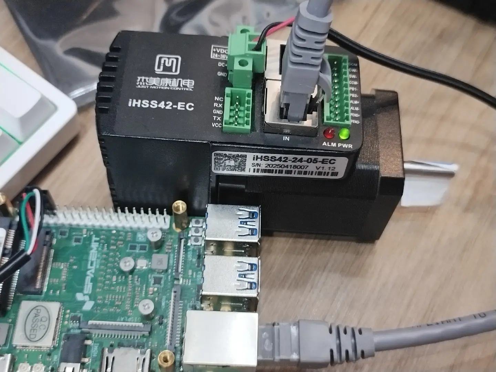

> 本文档介绍如何基于Ethercat协议控制一体化伺服电机，以杰美康IHSS42-24-05-EC为例。

# 硬件连接



如图所示，接入电机电源，网线一端连接电机IN口，另一端插入开发板网口，电源指示灯常亮表示电机正常工作。


# 环境设置

## **更新内核以启用EtherCAT**

```
# 下载内核包
wget https://cdn-resource.spacemit.com/file/download/linux-image-6.6.63_6.6.63-20260311161959_riscv64.deb

# 安装内核包
sudo dpkg -i linux-image-6.6.63_6.6.63-20260311161959_riscv64.deb

# 验证DTB源文件位置
ls -la /usr/lib/linux-image-6.6.63/spacemit/

# 更新bootfs分区的DTB文件（关键步骤！）
# 确保目录存在
sudo mkdir -p /boot/spacemit/6.6.63

# 复制DTB文件
sudo cp /usr/lib/linux-image-6.6.63/spacemit/k1-x_MUSE-Pi-Pro.dtb \
   /boot/spacemit/6.6.63/k1-x_MUSE-Pi-Pro.dtb

# 确保修改已同步到磁盘
sudo sync

# 重启系统
sudo reboot
```

> [!CAUTION]
>
> **安装内核包之后一定要复制DTB文件之后再重启内核，否则会导致系统崩溃。**

重启后，在板子上验证：

```bash
# 检查内核版本
uname -a

# 验证EtherCAT设备节点
ls -la /dev/EtherCAT0
```

预期输出示例：

```
root@k1:~/ros2_ws# uname -a
Linux k1 6.6.63 #20260311161959 SMP PREEMPT Wed Mar 11 16:20:38 CST 2026 riscv64 riscv64 riscv64 GNU/Linux

root@k1:~/ros2_ws# ls -la /dev/EtherCAT0
crw------- 1 root root 240, 0 Mar 11 17:46 /dev/EtherCAT0
```

## 修改设备节点权限（非root用户）

如果用普通用户运行ROS2节点，需要修改权限：

```bash
sudo chown bianbu:bianbu /dev/EtherCAT0
sudo chmod 660 /dev/EtherCAT0

# 查看权限
ls -la /dev/EtherCAT0
```

也可以创建udev规则使权限永久生效：

```bash
sudo bash -c 'cat > /etc/udev/rules.d/50-ethercat.rules << EOF
KERNEL=="EtherCAT0", MODE="0666", GROUP="plugdev"
EOF'

# 重新加载udev规则
sudo udevadm control --reload
sudo udevadm trigger
```

# 依赖安装

## 启用进迭时空 ROS2 储存库

```shell
grep -q '^Suites:.*\bnoble-ros\b' /etc/apt/sources.list.d/bianbu.sources || sudo sed -i '0,/^Suites:/s//& noble-ros/' /etc/apt/sources.list.d/bianbu.sources
```

```
if ! dpkg -s bianbu-desktop-lite >/dev/null 2>&1; then
  echo "bianbu-desktop-lite not installed, proceeding..."

  if [ ! -f /etc/apt/preferences.d/noble-ros.pref ]; then
    sudo tee /etc/apt/preferences.d/noble-ros.pref > /dev/null <<EOF
Package: src:opencv
Pin: release o=Spacemit, n=noble-ros
Pin-Priority: 50

Package: src:qtbase-opensource-src
Pin: release o=Spacemit, n=noble-ros
Pin-Priority: 50

Package: src:qtbase-opensource-src-gles
Pin: release o=Spacemit, n=noble-ros
Pin-Priority: 50

Package: src:pyqt5
Pin: release o=Spacemit, n=noble-ros
Pin-Priority: 50
EOF
  else
    echo "/etc/apt/preferences.d/noble-ros.pref already exists, skipping..."
  fi

else
  echo "bianbu-desktop-lite is already installed, skipping preference setup."
fi
```

```
sudo apt update
```

## 安装ROS2开发工具

```shell
sudo apt install ros-dev-tools
```

## ROS-Base安装

包含：通信库、消息包、命令行工具。没有 GUI 工具。

```shell
sudo apt install ros-humble-ros-base
```

或者选择安装 `ros-humble-desktop`，这包含了 rqt 等常见可视化工具。

## 安装ROS2运行时依赖

```bash
sudo apt install -y \
    ros-humble-ros-core \
    ros-humble-ros2-control \
    ros-humble-controller-manager \
    ros-humble-ros2cli

# 安装ROS2开发工具
sudo apt install -y \
    ros-humble-ament-cmake \
    ros-humble-ament-lint-auto \
    ros-humble-ament-lint-common

# 安装ROS2控制器框架依赖（必须）
sudo apt install -y \
    ros-humble-control-msgs \
    ros-humble-hardware-interface \
    ros-humble-xacro \
    ros-humble-joint-state-broadcaster \
    ros-humble-joint-trajectory-controller \
    ros-humble-joint-state-publisher \
    ros-humble-joint-state-publisher-gui
```

# 下载代码

## 创建工作区

```bash
mkdir -p ~/ros2_ws/src
cd ~/ros2_ws/src
```

## 下载源代码包

```bash
# 下载ethercat控制包
git clone https://github.com/wangannyi/jobot_protocol_bringup.git

# 下载ethercat_driver依赖
git clone https://github.com/ICube-Robotics/ethercat_driver_ros2.git
cd ethercat_driver_ros2
git checkout humble  # 切换到Humble分支（重要！）
```


# 启动与控制

## 启动ethercat master服务

**（1）启动服务**

```bash
# 进入资源目录
cd ~/ros2_ws/src/jobot_protocol_bringup/resource/

# 复制依赖库到系统环境
unzip lib_file.zip
cd lib_file
cp -r etc/* /etc/
cp -r bin/* /bin
cp -r lib/* /lib/
cp -r sbin/* /sbin/

mkdir -p /usr/local/etherlab/include/
cp include/* /usr/local/etherlab/include/

# 启动服务
cd ..
./igh_driver
```

**（2）查看EtherCAT主站状态：**

```bash
ethercat master
```

预期输出：

```
root@k1:~/ros2_ws# ethercat master
Master0
  Phase: Idle
  Active: no
  Slaves: 1
  Ethernet devices:
    Main: fe:fe:fe:c4:9a:9d (attached)
      Link: UP
      Tx frames:   1310593
      Tx bytes:    79910456
      Rx frames:   1310592
      Rx bytes:    79910396
      Tx errors:   0
      Tx frame rate [1/s]:    125    125    125
      Tx rate [KByte/s]:      7.3    7.3    7.3
      Rx frame rate [1/s]:    125    125    125
      Rx rate [KByte/s]:      7.3    7.3    7.3
    Common:
      Tx frames:   1310593
      Tx bytes:    79910456
      Rx frames:   1310592
      Rx bytes:    79910396
      Lost frames: 0
      Tx frame rate [1/s]:    125    125    125
      Tx rate [KByte/s]:      7.3    7.3    7.3
      Rx frame rate [1/s]:    125    125    125
      Rx rate [KByte/s]:      7.3    7.3    7.3
      Loss rate [1/s]:          0      0      0
      Frame loss [%]:         0.0    0.0    0.0
  Distributed clocks:
    Reference clock:   Slave 0
    DC reference time: 0
    Application time:  0
                       2000-01-01 00:00:00.000000000
```

**（3）查看从站设备：**

```bash
ethercat slave
```

预期输出：

```
root@k1:~/ros2_ws# ethercat slave
0  0:0  PREOP  +  IHSS42-EC
```

## 启动ROS2控制节点

**（1）安装编译依赖：**

```bash
cd ~/ros2_ws

# 使用rosdep安装所有依赖
export ROS_DISTRO=humble
sudo rosdep init
rosdep update
rosdep install --from-paths src --ignore-src -r -y

# 额外依赖（某些情况下rosdep可能遗漏）
sudo apt install -y \
    python3-lxml \
    python3-yaml
```

**（2）编译jobot_protocol_bringup及其依赖包：**

```bash
cd ~/ros2_ws
source /opt/ros/humble/setup.bash

# 编译ethercat驱动包
colcon build --packages-up-to ethercat_driver

# 编译CiA402电机驱动插件（用于步进电机控制）
colcon build --packages-up-to ethercat_generic_cia402_drive

# 编译协议bringup包
colcon build --packages-up-to jobot_protocol_bringup
```

**（3）验证编译结果：**

```bash
# 检查是否有编译失败
colcon list

# 检查关键包是否编译成功
colcon list | grep ethercat
colcon list | grep jobot_protocol
```

**（4）打开终端，启动控制节点：**

```bash
source install/setup.bash

# 启动
ros2 launch jobot_protocol_bringup motor_drive.launch.py
```

## 控制电机

打开一个新终端，发送电机控制指令：

```bash
# 在另一个终端中执行
cd ~/ros2_ws
source /opt/ros/humble/setup.bash
source install/setup.bash

# 检查ROS2节点状态
ros2 node list

# 检查可用的话题
ros2 topic list

# 发送位置指令（持续以0.2Hz频率）
ros2 topic pub -r 0.2 /trajectory_controller/joint_trajectory \
  trajectory_msgs/msg/JointTrajectory \
  '{header: {stamp: {sec: 0, nanosec: 0}, frame_id: ""}, 
    joint_names: ["joint_1"], 
    points: [
      {positions: [100.0], velocities: [0.0], accelerations: [0.0], time_from_start: {sec: 1, nanosec: 0}},
      {positions: [10000.0], velocities: [0.0], accelerations: [0.0], time_from_start: {sec: 5, nanosec: 0}}
    ]}'
```

电机将按轨迹点序列转动。

**参数说明**

```bash
1.
- ros2 topic pub

  ---  发布话题

2.
- -r 0.2

  ---  指定以0.2 Hz的速率发布（即5s一次）

3.
- /trajectory_controller/joint_trajectory

--- 话题名
  由控制器名称trajectory_controller + 功能joint_trajectory组成
  需与控制器配置文件（controllers.yaml）中匹配

4.
- trajectory_msgs/msg/JointTrajectory

--- ROS2中用于描述关节轨迹的标准消息类型

5.
##消息内容，格式在ROS中定义
- {header: {stamp: {sec: 0, nanosec: 0}, frame_id: ""}

--- 消息头部，携带元数据

参数：
        - stamp: {sec: 0, nanosec: 0} --- 消息时间戳，（0,0）表示使用控制器接收消息的当前时间作为轨迹开始时间
        - frame_id: ""    --- 参考坐标系名称，空字符串表示不指定


6.
- joint_names: ["joint_1"]

--- 需要控制的关节名称列表，与控制器配置文件中定义的关节名必须完全一致


7.
- points: [
{positions: [100.0], velocities: [0.0], accelerations: [0.0], time_from_start: {sec: 1, nanosec: 0}},

{positions: [10000.0], velocities: [0.0], accelerations: [0.0],time_from_start: {sec: 5, nanosec: 0}}
]

--- 轨迹点列表，每个点定义了关节在某个时刻的状态

参数：
      - positions: [100.0]      --- 关节目标位置
      - velocities: [0.0]       --- 关节到达该点时的目标速度
      - accelerations: [0.0]    --- 关节到达该点时的目标加速度
      - time_from_start: {sec: 1, nanosec: 0}   --- 从轨迹开始~到达该点的时间
```


## 读取电机位置信息

打开一个新终端，实时显示关节状态：

```bash
cd ~/ros2_ws
source install/setup.bash
ros2 topic echo /joint_states
```

这样可以查看电机的实时位置、速度和扭矩等信息。
