sidebar_position: 2

# 1. 注册和登录

浏览器进入登录地址<https://gdriscv.com/，>
或手机扫描二维码(推荐使用电脑登录)：

进入登录界面后如果没有账号，点击立即注册，

使用手机号码进行注册，点击"立即注册"按钮

登录成功之后，进入控制台界面：

# 2. 申请实例

点击”申请实例”按钮，跳转到申请实例界面
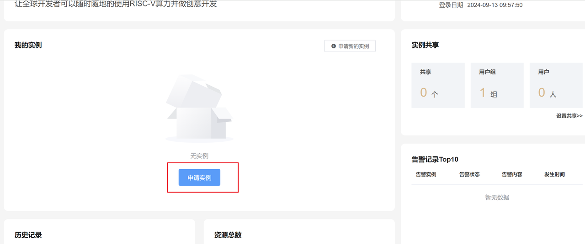
选择系统镜像“Bianbu”

修改实例名，也可以保持默认

点击同意协议后，点击“开始使用”按钮：
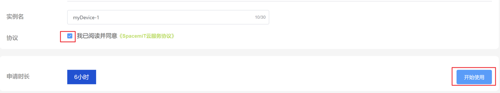
申请成功后，会自动跳转到控制台查看“我的实例”：

点击实例卡片，可查看实例的详细信息，点击"我的实例"可返回实例卡片
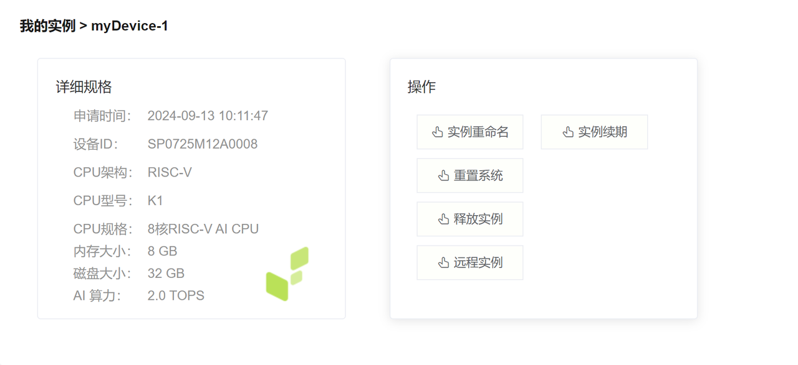
备注：如果申请实例失败，提示设备不足，可以选择其他操作系统镜像进行申请

# 3. 远程调试

在控制台点击“开始远程”按钮：

进入远程工作台, bianbu系统对应root密码为bianbu，deepin系统对应密码为deepin：

## 3.1 命令行和串口

主界面是命令行交互界面：
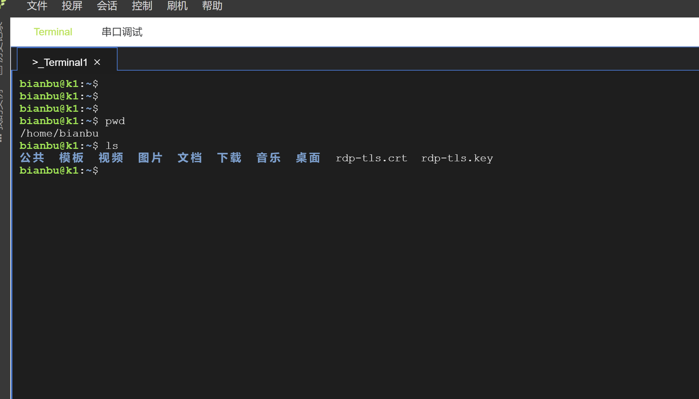
点击右上角，支持多开和分屏操作：
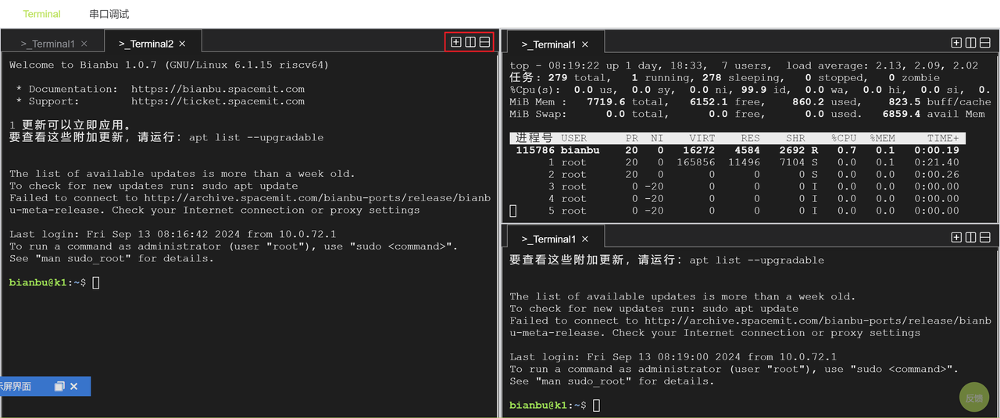

点击右下角终端字体，可以调整命令行的字体大小和字体格式：
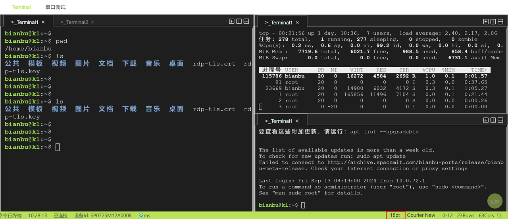
点击“串口调试”可查看实例的串口输出：

## 3.2 远程桌面

点击“投屏按钮”，可以打开实例的显示桌面：

点击“放大”按钮, 可最大化显示：
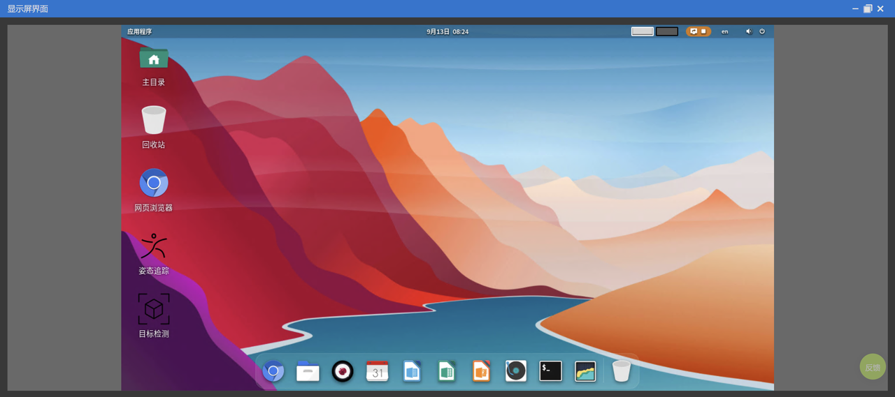

## 3.3 文件操作

点击左上角，“文件” -> “打开文件树管理”，可以进行文件上传下载

备注：上传下载文件只能在“/home/bianbu/”目录下进行，其他路径无权限

双击左侧目录树的某个文件，比如“.profile”，可进行在线编辑：
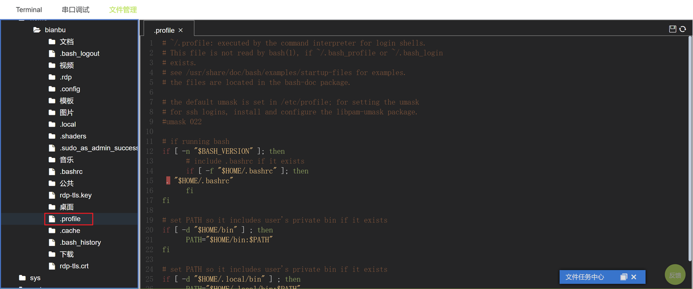
编辑文件成功后，点击右上角“保存”按钮，可以保存编辑的文件：
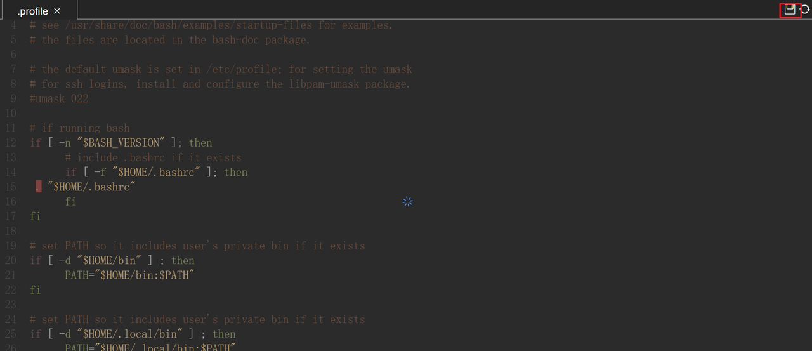

## 3.4 在线刷机操作

点击“刷机” -> “打开刷机面板”

选择合适的操作系统镜像，进行刷机：
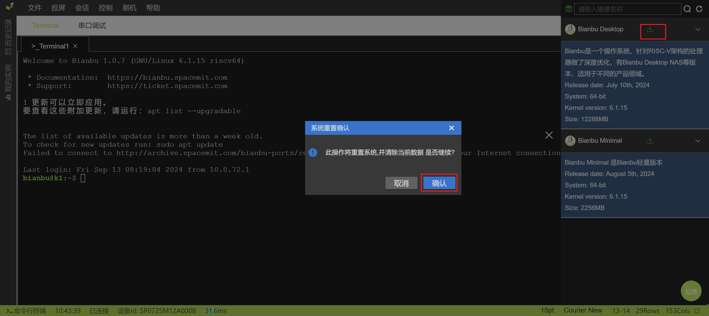
备注：刷机操作会将之前的实例数据清空，请注意保存实例数据
不同的操作系统镜像，刷机时间不同，可等待刷机进度：
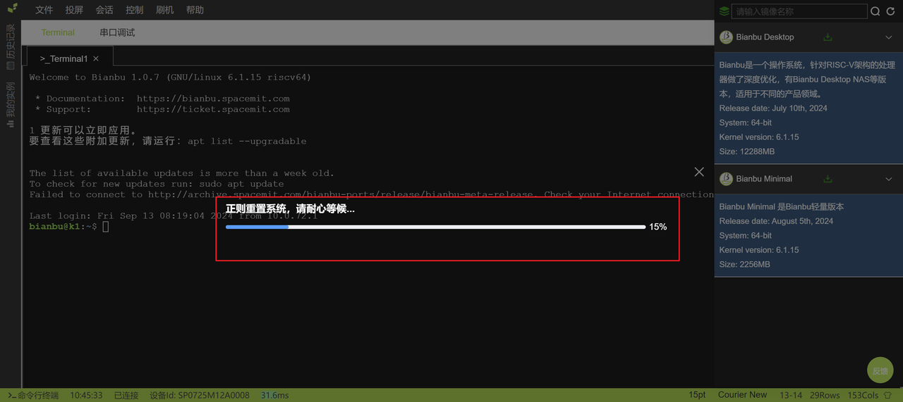

# 4. 调用API

API仅支持私有化部署使用，BianbuCloud公网不提供该服务，下面是参考示例：
点击右上角“头像图标”进入设置界面，点击“API KEY” 查看Token信息：

进入实例的调试界面，运行一个服务，并绑定18080端口，如下简单使用python运行一个http服务：
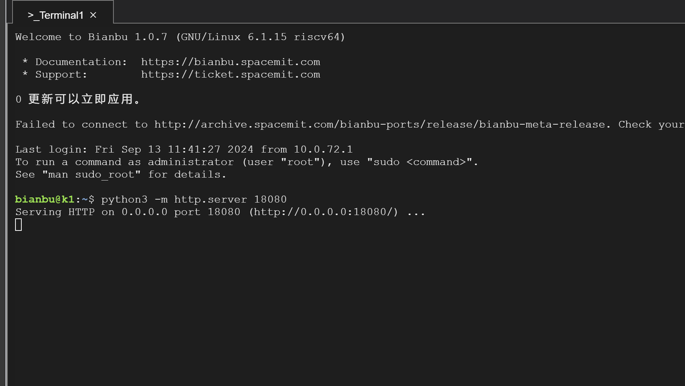
使用Apifox模拟请求实例的Get或Post接口，deviceI为实例的设备ID：

填入Token信息：
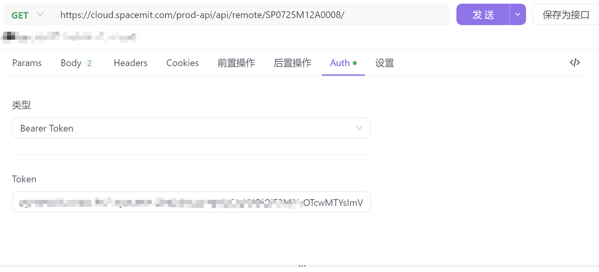
接口请求地址为：<https://cloud.spacemit.com/prod-api/api/remote/{deviceId}/>

备注：目前只支持GET+POST请求，单个实例每天最大请求限制100次，服务的端口只支持18080端口

# 5. 退出登录

进入控制台，点击右上角“头像图标”：
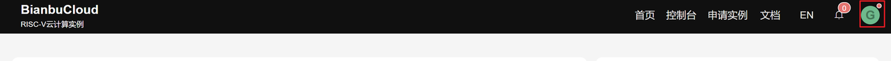
点击“退出登录”按钮：
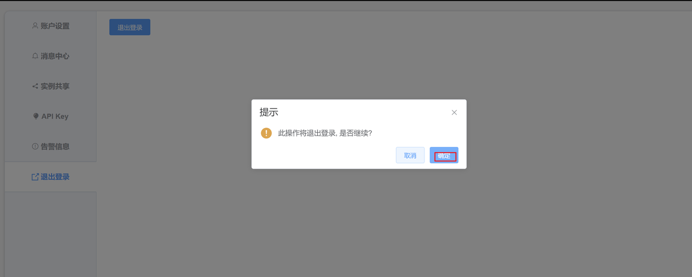
