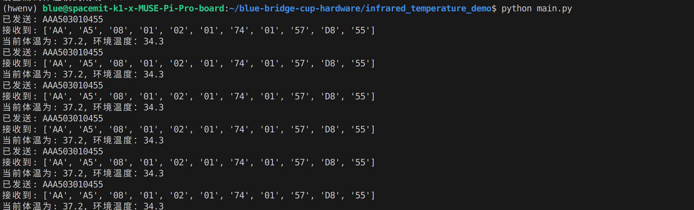
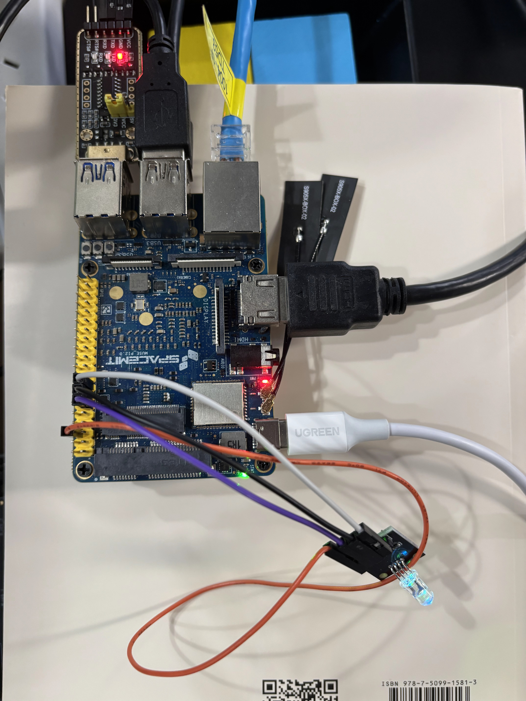
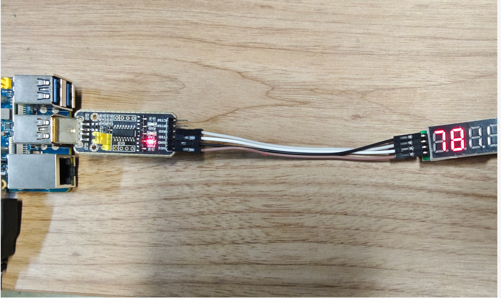

sidebar_position: 5

> 本文列出已在Muse Pi Pro上调试过的硬件模块及使用说明，可供开发者参考。

# 1. 环境搭建

**（1）安装系统依赖**

```
sudo apt update
sudo apt install -y libopenblas-dev \
		python3-dev \
		python3-venv \
		libcjson-dev \
		libasound2-dev
```

**（2）安装python依赖**

设置python pip源：

```
pip config set global.index-url https://pypi.tuna.tsinghua.edu.cn/simple
pip config set global.extra-index-url https://git.spacemit.com/api/v4/projects/33/packages/pypi/simple
```

创建虚拟环境：

```
python3 -m venv ~/hwenv
source ~/hwenv/bin/activate
```

在虚拟环境中安装python依赖：

```
pip install gpiozero==2.0.5
pip install lgpio==0.2.2.0
pip install pyserial
pip install smbus
```

# 2. 引脚示意图

Muse Pi Pro开发板引脚示意图如下所示：


# 3. USB转串口设置

### **USB转串口设备映射规范**

所有硬件模块均通过USB转串口设备与开发板连接，系统自动识别并映射以下芯片型号：

- CH343系列芯片 → `/dev/ttyACM*`（CDC-ACM协议设备）
- CH340系列芯片 → `/dev/ttyUSB*`（标准USB串行设备）

### **权限配置指南**

（1）创建UDEV规则文件

执行以下命令配置通用权限规则：

```bash
# 配置CH343设备权限（ttyACM*）
sudo tee /etc/udev/rules.d/99-usb-serial.rules <<<'KERNEL=="ttyACM*", MODE="0666"'

# 配置CH340设备权限（ttyUSB*）
sudo tee /etc/udev/rules.d/100-usb-serial.rules <<<'KERNEL=="ttyUSB*", MODE="0666"'
```

（2）应用配置变更

```bash
# 重新加载规则并触发设备更新
sudo udevadm control --reload-rules && sudo udevadm trigger
```

（3）查看权限是否生效

```bash
# 查看CH343系列串口设备
ls -al /dev/ttyACM* 
# 输出应该类似：
# crw-rw-rw- 1 root dialout 166, 0  1月17日 17:56 /dev/ttyACM0

# 查看CH340系列串口设备
ls -al /dev/ttyUSB*
# 输出应该类似：
# crw-rw-rw- 1 root dialout 166, 0  1月17日 17:56 /dev/ttyUSB0
```

# 4. 硬件模块参考列表

在进行硬件模块调试之前，请先进行环境搭建和USB转串口设置。

## 4.1 ToF激光雷达测距传感器

ToF（Time of Flight，飞行时间）激光雷达是一种基于光脉冲飞行时间原理的非接触式测距传感器，通过测量激光发射到目标物体并反射回来的时间差，计算目标距离。

### 4.1.1 官网资料

产品资料参考：[https://www.waveshare.net/wiki/TOF_Laser_Range_Sensor_Mini](https://www.waveshare.net/wiki/TOF_Laser_Range_Sensor_Mini)

### 4.1.2 UART使用示例

#### **硬件连接**

ToF激光雷达通过USB串口设备与开发板连接如图所示：

<figure style="text-align: center;"> <!-- 设置居中 -->
   <!-- 调整大小 -->
</figure>

#### 确认串口信息

连接好之后，执行下述命令查看设备是否存在以及权限是否正确：

查看CH343系列串口设备：

```
ls -al /dev/ttyACM*
```

查看CH340系列串口设备：

```
ls -al /dev/ttyUSB*
```

#### 设备测试

（1）下载测试代码：[ToF激光雷达测试代码](code/blue-bridge-cup-hardware/TOF_Laser_Range_Sensor_demo)

（2）下载执行下述命令解压：

```
unzip TOF_Laser_Range_Sensor_demo.zip
```

（3）进入虚拟环境运行测试脚本：

```
source ~/hwenv/bin/activate
cd TOF_Laser_Range_Sensor_demo/python/UART/example
python main.py
```

（4）查看输出结果如图所示：


## 4.2 红外测温模块

红外测温模块基于红外辐射定律（普朗克黑体辐射定律），通过检测物体表面发射的红外能量，结合环境温度补偿，计算得出目标温度。

### 4.2.1 规格书

规格书下载：[安服优红外测温模块规格书](hw_modules/B-1红外测温模块规格书_V2.1.pdf)

### 4.2.2 通信协议

通信协议参考：[安服优红外测温模块通信协议](hw_modules/B-1红外测温模块通信协议_V2.1.pdf)

### 4.2.3 UART使用示例

#### 硬件连接

上电之后，红外测温模块通过USB串口设备与开发板连接如图所示：

<figure style="text-align: center;"> <!-- 设置居中 -->
   <!-- 调整大小 -->
</figure>

#### 确认串口信息

连接好之后，执行下述命令查看设备是否存在以及权限是否正确：

查看CH343系列串口设备：

```
ls -al /dev/ttyACM*
```

查看CH340系列串口设备：

```
ls -al /dev/ttyUSB*
```

#### 设备测试

（1）下载测试代码：[红外测温模块测试代码](code/blue-bridge-cup-hardware/infrared_temperature_demo)

（2）下载执行下述命令解压：

```
unzip infrared_temperature_demo.zip
```

（3）进入虚拟环境运行测试脚本：

```
source ~/hwenv/bin/activate
cd infrared_temperature_demo
python main.py
```

（4）查看输出结果如图所示：



#### 切换体温和物温模式

测物体温度：

```Bash
python switch_to_object.py
python main.py
```

测人体体温：

```Bash
 python switch_to_body.py
 python main.py
```

## 4.3 RGB-LED

RGB-LED（红绿蓝LED）是一种能够发出红色、绿色和蓝色光的多色 LED 灯。它由三个独立的 LED 元件组成，每个元件分别控制红、绿、蓝三种颜色的光。通过调节这三种颜色的亮度，RGB-LED 可以组合出不同的颜色，广泛应用于显示、指示灯、照明和装饰等领域。

### 4.3.1 gpiozero库介绍

树莓派通常使用RPi.GPIO库来控制GPIO引脚，在Bianbu Star系统上， RPi.GPIO库尚未移植，提供gpiozero库来控制引脚输出。gpiozero库是一种高层次的Python库，简化了硬件接口的使用，非常适合用于教育和开发。

更多信息可以参考 Bianbu 官网：[从 Python 使用 GPIO](https://bianbu.spacemit.com/development/python/#从-python-使用-gpio)

### 4.3.2 引脚控制用例

#### 硬件连接

RGB-LED 彩灯与开发板的连接方式如下图所示：

- GPIO-71引脚连接B引脚（控制蓝灯）
- GPIO-72引脚连接G引脚（控制绿灯）
- GPIO-73引脚连接R引脚（控制红灯）

<figure style="text-align: center;"> <!-- 设置居中 -->
   <!-- 调整大小 -->
</figure>

#### LED控制用例

（1）下载测试代码：[RGB-LED测试代码](code/blue-bridge-cup-hardware/led)

（2）下载执行下述命令解压：

```
unzip led.zip
```

（3）进入虚拟环境运行测试脚本：

```
source ~/hwenv/bin/activate
cd led
python led.py
```

启动程序之后，彩灯会循环地闪烁红灯、绿灯、蓝灯。

## 4.4 数码管

数码管（又称七段显示器）是一种广泛用于显示数字或字母的电子显示设备。它由七个独立的发光二极管（LED）组成，通常排列成数字“8”形状，每个 LED 对应一个显示段，通过点亮不同的组合，可以显示数字 0 至 9 以及一些字母。

### 4.4.1 产品参考资料

本案例使用4位数码管，产品说明请参考淘宝链接详情页：[数码管产品参考资料](https://detail.tmall.com/item.htm?app=chrome&bxsign=scdau3pWHZJtSJhIYnsHvG3A2WDgcY8spWd6MmL0_zjYCOlC9p2mwFRFEP8jvcTUrY0EYl4tkRQkG7BerxX3LNJvsIODBL4nv9DJ-847tik6OrzNECnU1xkE2VtMhc5F7ct&cpp=1&id=727613625159&price=14.8&shareUniqueId=31214097412&share_crt_v=1&shareurl=true&short_name=h.6idhnSPBd9GJW1x&skuId=5045331372905&sourceType=item&sp_tk=b2JUZlZiencwRng%3D&spm=a2159r.13376460.0.0&suid=418035f0-469e-40c5-ab92-f762fdd91da3&tbSocialPopKey=shareItem&tk=obTfVbzw0Fx&un=cf7d2a79859247a5cd8415ff413d3508&un_site=0&ut_sk=1.Zq25wvEgVzgDAPruPfVLxohH_21646297_1744772216985.Copy.1&wxsign=tbwvzHBe2u2lOKNxsviRS2fhQZnRCyv1-0_u-sYI02hWMb5_Gr5NZfPGGHXfxua8e8H30pP6fFyUmWMlMiIEGpCdCFva65ZcyheuEioHaGH2L6c44jx8_TN21VCmZaa9WOn)

### 4.4.2 UART试用示例

#### 硬件连接

数码管通过UART与开发板连接如图所示：



#### 确认串口信息

连接好之后，执行下述命令查看设备是否存在以及权限是否正确：

查看CH343系列UART设备：

```
ls -al /dev/ttyACM*
```

查看CH340系列UART设备：

```
ls -al /dev/ttyUSB*
```

#### 设备测试

（1）下载测试代码：[数码管测试代码](code/blue-bridge-cup-hardware/digital_tube)

（2）下载执行下述命令解压：

```
unzip digital_tube.zip
```

（3）进入虚拟环境运行测试脚本：

```
source ~/hwenv/bin/activate
cd digital_tube
python digital_serial.py
```

启动程序之后，数码管会依次显示11、345、66、78数字。

## 4.5 二维云台舵机

二维云台舵机（2D Pan-Tilt Servo）是一种用于精确控制相机或其他设备在水平方向（俯仰）和垂直方向（左右）上的运动的机械系统。它通常用于无人机、机器人、监控摄像头、卫星通讯设备等领域，用于实时调整设备的视角，以便更好地获取目标对象的图像或数据。

### 4.5.1 技术参考资料

测试的二维云台采用高性能伺服电机驱动，可通过PWM信号实现精确角度控制。

详细技术参数和API文档可参考：[GPIO Zero Servo官方文档](https://gpiozero.readthedocs.io/en/stable/api_output.html#servo)

幻尔二维云台参数说明请参考：[幻尔二维云台商品详情](https://detail.tmall.com/item.htm?abbucket=16&detail_redpacket_pop=true&id=626310297516&ns=1&pisk=gcnIEA0sZ6fBA9rRFyvaCZjATYZ5zd-VOTw-nYIFekELwVMmNWJk-ku_Nfh_9MJH-zFStkUo87PUNuMoGdR20nknKu4JgI-4Jc3LrobLpgCPX5eUVJKBbFJKKuqJNOSJunMnMsyW6ae8BdwzUgQKwyCTW-NTewE-w5UTH-5L2bh8XlezH7Q8JwFT6524eaFLJAUTL-bLp8h-Bdwu67E8ybHtB-K_QLPIdpUes2oH_6hL1gI-fROuMvOOj8nLdkFjpP_flL2QRSHL6I-lUfatEzilEgarpqcuHXCpN7msBD3xMC7U9qwS34GvUw2aPDq_wDKch5nIFcan76QLhkNQkDhOnKk_yVi_YDdloAk_9rZZ7FAUzkGIoS4pSCcSCWl-APCB_7uqQDUsMCSsZzg-Ylnp6nsPCiPf-jb5Crj7CSJ6CabkrwdfVjAQsczLIR52Cd1QXyegCSJ6CabuJR2wQd91OlC..&priceTId=undefined&query=%E8%88%B5%E6%9C%BA%E4%BA%91%E5%8F%B0&skuId=5517003508413&spm=a21n57.1.hoverItem.26&utparam=%7B%22aplus_abtest%22%3A%22e6dd28f1f527cbbf8f93a6148f434a28%22%7D&xxc=taobaoSearch)

### 2.5.2 PWM使用示例

#### 硬件连接指南

电源连接：

- 伺服电机红色电源线 → 开发板5V输出引脚
- 伺服电机黑色/棕色地线 → 开发板GND引脚

信号连接：

- 伺服电机橙色/白色信号线 → 控制伺服的GPIO引脚

对照第2章的引脚图，开发板与云台的连接如图所示，信号线（橙色）连接到GPIO-73号引脚：

<figure style="text-align: center;"> <!-- 设置居中 -->
   <!-- 调整大小 -->
</figure>

#### 设备测试

（1）下载测试代码：[二维云台测试代码](code/blue-bridge-cup-hardware/steering_gimbal)

（2）下载执行下述命令解压：

```
unzip steering_gimbal.zip
```

（3）进入虚拟环境运行测试脚本：

```
source ~/hwenv/bin/activate
cd steering_gimbal
python base_control.py
```

（4）查看输出结果如图所示：


根据提示输入[-1,1]之间的浮点数即可控制舵机在最小位置和最大位置之间的运动。


# 5. I2C使用说明

i2c的工具在： ~/blue-bridge-cup-hardware/dev-tools/i2ctools

```
cd ~/blue-bridge-cup-hardware/dev-tools/i2ctools
```

## 可用的I2C引脚

i2c-3 与 i2c-4 为可用状态，对应如下：


## 查看当前有哪些 I2C 总线

```Bash
sudo ./i2cdetect -l
```

输出如下：

```Python
i2c-3        i2c               spacemit-i2c-adapter                    I2C adapter
i2c-1        i2c               spacemit-i2c-adapter                    I2C adapter
i2c-8        i2c               spacemit-i2c-adapter                    I2C adapter
i2c-4        i2c               spacemit-i2c-adapter                    I2C adapter
i2c-2        i2c               spacemit-i2c-adapter                    I2C adapter
i2c-0        i2c               spacemit-i2c-adapter                    I2C adapter
i2c-9        i2c               spacemit-i2c-adapter                    I2C adapter
i2c-5        i2c               spacemit-i2c-adapter                    I2C adapter
```

## 查看某个总线上连接的设备

硬件连接如图：


```Bash
sudo ./i2cdetect -yr 4
```

其中 3 是总线编号（比如 i2c-4），你可以选择3或者4。

输出类似：

```sql
     0  1  2  3  4  5  6  7  8  9  a  b  c  d  e  f
00:          -- -- -- -- -- -- -- -- -- -- -- -- -- 
10: -- -- -- -- -- -- -- -- -- -- -- -- -- -- -- -- 
20: -- -- -- -- -- -- -- -- -- -- -- -- -- -- -- -- 
30: -- -- -- -- -- -- -- -- -- -- -- -- -- -- -- -- 
40: -- -- -- -- -- -- -- -- -- -- -- -- -- -- -- -- 
50: -- -- -- -- -- -- -- -- -- -- -- -- -- -- -- -- 
60: -- -- -- -- -- -- -- -- 68 -- -- -- -- -- -- -- 
70: -- -- -- -- -- -- -- --
```

表示检测到地址 0x68 上有设备


之后你可以使用 python 的 smbus 库完成i2c设备的使用