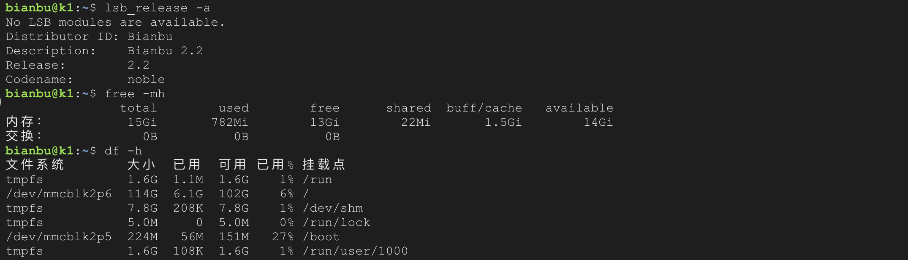

# 大语言模型部署指南

本文以 Qwen2.5-14B 为例，介绍如何在 K1 上使用 Ollama 部署大语言模型。

## 系统配置

本文档所用系统配置如下：

- 系统：Bianbu Cloud v2.0rc2
- 内存：16GB
- 硬盘空间：128GB
- 额外：配置 Swap 扩展内存 (小内存可选)

> 大模型运行占用内存较高，如果实际内存不足，可创建 Swap 文件扩展虚拟内存，防止运行中 OOM。



## 创建 Swap (可选)

```bash
sudo fallocate -l 16G /swapfile
sudo chmod 600 /swapfile
sudo mkswap /swapfile
sudo swapon /swapfile
swapon --show
echo '/swapfile swap swap defaults 0 0' | sudo tee -a /etc/fstab
```

Swap 可以根据实际内存情况调整大小，建议不超过硬盘剩余容量的一半。

## 安装 Spacemit Ollama

```bash
sudo apt update
sudo apt install spacemit-ollama-toolkit
```

### 验证安装

```bash
ollama list
```

若输出 `NAME  ID  SIZE  MODIFIED` 表示安装成功。

### 验证版本

```bash
sudo apt show spacemit-ollama-toolkit
```

确认版本为 0.0.8 或以上，以支持新的模型格式和直接拉取功能。

## 下载模型

### 方式一：直接拉取

Ollama 0.0.8 起支持 `q4_K_M` 和 `q4_1` 格式模型，可以直接拉取：

```bash
# 拉取 Qwen2.5-14B-Instruct（q4_K_M 格式）
ollama pull qwen2.5:14b
```

### 方式二：手动制作模型

如果 `ollama pull` 不支持 RISC-V 或下载超时，可以手动从 ModelScope 或 HuggingFace 下载。

#### 安装工具

```bash
sudo apt install wget
```

#### 下载 GGUF 量化模型

- ModelScope 下载：

```bash
wget https://www.modelscope.cn/models/Qwen/Qwen2.5-14B-Instruct-GGUF/resolve/master/qwen2.5-14b-instruct-q4_0.gguf -O ~/Qwen2.5-14B-Instruct-Q4_0.gguf
```

- 或者 HuggingFace 下载：

```bash

mkdir -p ~/models/qwen2.5-14b
cd ~/models/qwen2.5-14b

wget https://huggingface.co/Qwen/Qwen2.5-14B-Instruct-GGUF/resolve/main/qwen2.5-14b-instruct-q4_0-00001-of-00003.gguf
wget https://huggingface.co/Qwen/Qwen2.5-14B-Instruct-GGUF/resolve/main/qwen2.5-14b-instruct-q4_0-00002-of-00003.gguf
wget https://huggingface.co/Qwen/Qwen2.5-14B-Instruct-GGUF/resolve/main/qwen2.5-14b-instruct-q4_0-00003-of-00003.gguf
```

#### 创建 Modelfile

创建文件 qwen2.5-14b.modelfile，填充以下内容：

```bash
# 加载从 modelscope 下载的 gguf 模型
FROM "~/Qwen2.5-14B-Instruct-Q4_0.gguf"

# 或者加载从 huggingface 下载的分段模型。只需确保第一文件路径写在 FROM 行，其余文件放在同一目录即可，Ollama 会自动加载其他分片。
# FROM "~/models/qwen2.5-14b/qwen2.5-14b-instruct-q4_0-00001-of-00003.gguf"

# set the temperature to 1 [higher is more creative, lower is more coherent]
PARAMETER temperature 0.7
PARAMETER top_p 0.8
PARAMETER repeat_penalty 1.05
PARAMETER top_k 20

TEMPLATE """{{ if .Messages }}
{{- if or .System .Tools }}<|im_start|>system
{{ .System }}
{{- if .Tools }}

# Tools

You are provided with function signatures within <tools></tools> XML tags:
<tools>{{- range .Tools }}
{"type": "function", "function": {{ .Function }}}{{- end }}
</tools>

For each function call, return a json object with function name and arguments within <tool_call></tool_call> XML tags:
<tool_call>
{"name": <function-name>, "arguments": <args-json-object>}
</tool_call>
{{- end }}<|im_end|>
{{ end }}
{{- range $i, $_ := .Messages }}
{{- $last := eq (len (slice $.Messages $i)) 1 -}}
{{- if eq .Role "user" }}<|im_start|>user
{{ .Content }}<|im_end|>
{{ else if eq .Role "assistant" }}<|im_start|>assistant
{{ if .Content }}{{ .Content }}
{{- else if .ToolCalls }}<tool_call>
{{ range .ToolCalls }}{"name": "{{ .Function.Name }}", "arguments": {{ .Function.Arguments }}}
{{ end }}</tool_call>
{{- end }}{{ if not $last }}<|im_end|>
{{ end }}
{{- else if eq .Role "tool" }}<|im_start|>user
<tool_response>
{{ .Content }}
</tool_response><|im_end|>
{{ end }}
{{- if and (ne .Role "assistant") $last }}<|im_start|>assistant
{{ end }}
{{- end }}
{{- else }}
{{- if .System }}<|im_start|>system
{{ .System }}<|im_end|>
{{ end }}{{ if .Prompt }}<|im_start|>user
{{ .Prompt }}<|im_end|>
{{ end }}<|im_start|>assistant
{{ end }}{{ .Response }}{{ if .Response }}<|im_end|>{{ end }}"""

# set the system message
SYSTEM """You are Qwen, created by Alibaba Cloud. You are a helpful assistant."""
PARAMETER num_thread 4
```

#### 创建模型

```bash
ollama create qwen2.5:14b -f qwen2.5-14b.modelfile
```

## 使用

### 运行模型

```bash
ollama run qwen2.5:14b
```

系统将启动模型，等待用户输入进行交互或调用 API。