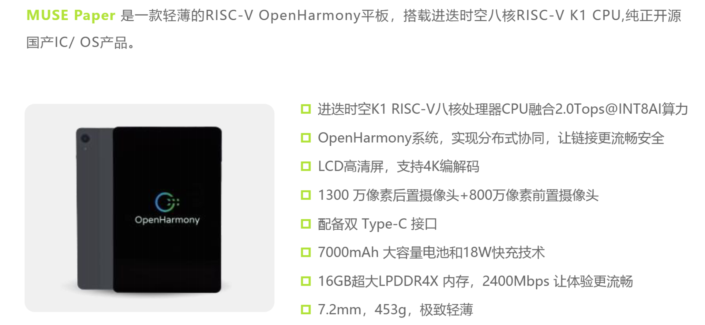

sidebar_position: 1

<!--
 * Copyright 2022-2023 SPACEMIT. All rights reserved.
 * Use of this source code is governed by a BSD-style license
 * that can be found in the LICENSE file.
 * 
 * @Author: David(qiang.fu@spacemit.com)
 * @Date: 2025-08-14 17:17:06
 * @LastEditTime: 2025-08-15 15:59:19
 * @FilePath: \telephonyy:\workspace\test\spacemit-riscv-content\docs\CIE比赛\03_OpenHarmony 使用相关参考文档及案例集\01_K1 OH5.0简介.md
 * @Description: 
-->

# 修订记录

| 修订版本 | 修订日期    | 修订说明       |
|----------|-------------|----------------|
| 001      | 2025-01-20  | 初始版本        |
| 002      | 2025-03-18  | 添加FAQ        |
| 003      | 2025-04-11  | 添加Muse Pi Pro|
| 004      | 2025-05-28  | 添加更新说明   |
| 005      | 2025-07-16  | 添加产品包框图 |
| 006      | 2025-08-15  | CIE修改版本   |

---
# 1. 概述

**K1 OH5.0**是由进迭时空推出的全球首个**RISC-V + OpenHarmony5.0**原生鸿蒙解决方案，CPU采用新**RISC-V AI CPU芯片K1**，操作系统采用**OpenHarmony5.0.0.71**。同时，基于RISC-V同构融合AI算力和开源大模型，构建了新AI算力平台。方案已经经过完整的系统集成测试和可靠性测试，并提供了全套开发文档，量产工具和原厂支持通道，全方位助力开发者轻松上手，高效开发。

发布产品包框图如下所示：

# 2. 开发包发布清单

<table>
  <thead>
    <tr>
      <th>类别</th>
      <th>文档名称</th>
      <th>备注/下载地址</th>
    </tr>
  </thead>
  <tbody>
    <tr>
      <td rowspan="2">软件</td>
      <td>K1 OH5.0应用开发说明</td>
      <td></td>
    </tr>
    <tr><td>K1 OH5.0 AI构建开发说明</td><td></td></tr>
    <tr><td rowspan="2">工具</td><td>刷机/写号工具：TitanFlasher</td><td><a href="https://developer.spacemit.com/documentation?token=O6wlwlXcoiBZUikVNh2cczhin5d">点我下载并获取使用说明</a></td></tr>
    <tr><td>应用开发：devecostudio-windows-5.0.5.310.zip</td><td><a href="https://archive.spacemit.com/tools/openharmony/devecostudio-windows-5.0.5.310.zip">点我下载</a></td></tr>
    <tr><td>SDK包</td><td>SDK包</td><td><a href="https://archive.spacemit.com/tools/openharmony/sdk/">下载路径</a></td></tr>
  </tbody>
</table>

# 3. 开发平台介绍

提供2种开发方式，分别是：
 - 使用MUSE Paper平板开发
 - 使用Bianbu Cloud云真机开发

| 开发方式 | 优势 | 劣势 |
|----------|----------|----------|
| MUSE Paper平板 | 真实设备体感更好，更多的外设，更多发挥空间 | 需要自费购买 |
| Bianbu Cloud云真机 | 免费提供 | 缺少喇叭，麦克风，usb等硬件，限制发挥 |

## 3.1. MUSE Paper（真机开发）

### 3.1.1. 简介

### 3.1.2. 硬件规格
<a href="https://developer.spacemit.com/documentation?token=HIrmwMT2piFuTRkusIrcO0ADngg&type=pdf">点我查看</a>

### 3.1.3. 使用指南
<a href="https://developer.spacemit.com/documentation?token=W6p5wcK2iiSB0Eke4P2cHQpunAd">点我查看</a>

### 3.1.3. 购买链接
<a href="https://e.tb.cn/h.hHZVpHaqfgiw04T?tk=uRtQ48EtBaM">点我购买</a>

## 3.2. Bianbu Cloud（云真机开发）
<a href="https://active.spacemit.com/doc/CIE%E6%AF%94%E8%B5%9B/03_OpenHarmony%20%E4%BD%BF%E7%94%A8%E5%8F%82%E8%80%83%E6%96%87%E6%A1%A3%E5%8F%8A%E6%A1%88%E4%BE%8B%E9%9B%86/04_Bianbu%20Cloud%E4%BD%BF%E7%94%A8%E8%AF%B4%E6%98%8E">使用指南</a>
