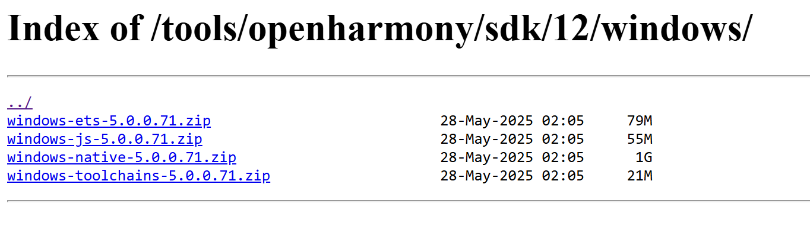

# 修订记录

| 修订版本 | 修订日期    | 修订说明       |
|----------|-------------|----------------|
| 001      | 2025-06-10  | 初始版本       |
| 002      | 2025-07-25  | 添加FAQ        |
| 003      | 2025-08-15  | CIE修改版本    |

---
# 1. OpenHarmony应用开发概述

## 1.1. ArkTS
ArkTS是鸿蒙（HarmonyOS/OpenHarmony）生态的官方主力应用开发语言，基于TypeScript（TS）扩展而来，是TS的超集扩展，继承TypeScript语法风格，强化静态类型检查（编译时检测错误，提升代码健壮性），兼容JS/TS生态，支持高效互操作，降低迁移门槛。

### 1.1.1. 核心技术特性
- 声明式UI开发范式
  - 通过装饰器（如@Entry、@Component）定义组件，以简洁的声明式语法构建界面逻辑
  - 提供状态管理（如@State），驱动数据变化自动更新UI
- 分布式与并发增强
  - 优化并发编程API，支持多线程任务调度（如Taskpool机制），提升跨设备协同性能
  - 为“一次开发，多端部署”提供底层支持，适配手机、平板、车机等全场景设备
- 性能与稳定性优化
  - 静态类型约束减少运行时类型检查，提高执行效率
  - 强制属性显式初始化（如类成员变量），避免未定义错误导致的运行时崩溃

## 1.2. ArkUI
ArkUI（方舟UI框架）是华为为HarmonyOS/OpenHarmony生态系统构建的声明式UI开发框架，专注于实现高效、高性能的跨设备应用界面开发。基于ArkTS语言扩展（TypeScript超集），通过组件化、状态驱动等机制简化UI构建逻辑，提供极简的UI语法（如装饰器@Component），开发者通过声明式描述界面结构而非命令式操作。


### 1.2.1. 核心技术特性
- 高性能渲染架构
  - 优化UI更新机制：将Diff算法从树形结构对比升级为单节点函数式更新，大幅提升渲染效率
  - 统一渲染引擎保障流畅动效，减少主线程卡顿
- 逻辑与UI解耦
  - 通过数据双向绑定简化状态管理，跨端开发代码量减少40%以上
  - 支持状态管理（如@State、@Link），实现数据变化自动驱动UI刷新
- 多形态组件库
  - 提供丰富内置组件（文本、按钮、列表等）及布局能力，覆盖基础界面到复杂交互场景
  - 支持自定义组件开发，满足业务定制化需求

## 1.3. Ark运行时（方舟运行时）
Ark运行时（又称方舟运行时）是HarmonyOS/OpenHarmony生态中支撑ArkTS/JS/TS语言执行的核心引擎，负责字节码运行、内存管理及跨语言互调等关键能力。

### 1.3.1. 核心架构组成
- 核心子系统（Core Subsystem）
  - 提供基础运行库，支撑字节码文件解析（File组件）、调试工具链（Tooling组件）及系统调用适配（Base库）
- 执行子系统（Execution Subsystem）
  - 包含字节码解释器、内联缓存优化机制，实现高效执行方舟字节码（.abc文件）
- 编译器子系统（Compiler Subsystem）
  - 支持AOT（预编译优化）、JIT（动态编译实验阶段）及基于IR的编译框架，提升代码执行效率
- 运行时子系统（Runtime Subsystem）
  - 内存管理‌：CMS-GC垃圾回收器实现并发标记与部分内存压缩
  - 跨语言接口‌：通过Node-API支持TS/JS/C++等多语言混合开发

### 1.3.2. 关键技术特性
- 多模式执行引擎
  - 同时支持解释执行、‌AOT预编译及实验性JIT动态编译‌，平衡启动速度与运行效率
- 高性能内存管理
  - 采用并行标记的CMS-GC算法，减少暂停时间；支持部分内存压缩，优化内存碎片
- 分布式调试支持
  - 内置Debugger工具链，实现跨设备协同开发时的实时诊断与性能分析
- 标准库兼容性
  - 完整实现ECMAScript规范，提供高效容器库（如Map/Set），保障JS/TS生态兼容

# 2. 开发环境搭建（windows）

## 2.1. DevEco Studio安装配置
- 下载工具：<a  href ="https://archive.spacemit.com/tools/openharmony/devecostudio-windows-5.0.5.310.zip">点我下载</a>，DevEco Studio是开发OpenHarmony应用程序的专用IDE
- 双击下载的**deveco-studio-xxxx.exe**，进入DevEco Studio安装向导，默认安装于**C:\Program Files**路径下，也可以安装到指定位置（**注意：不要出现中文或特殊字符**），然后单击**NEXT**

## 2.2. SDK工具链配置
OpenHarmony的SDK是专为OpenHarmony系统设计的软件开发工具包，它能够提供开发原生应用所需的基础能力和工具集。所以，我们需要下载并且配置好SDK才能够进行应用开发。

### 2.2.1. Public SDK与Full SDK
在**OpenHarmony**中，**Public SDK**与**Full SDK**是面向不同开发场景的工具包，其核心差异如下：
- API权限

| 类型 | 权限说明 |
|----------|----------|
| Public SDK | 提供给普通应用开发者使用，仅包含开放API‌，不涉及系统敏感权限（如@ohos.app.ability.abilityManager、蓝牙控制等高权限接口） |
| Full SDK | 面向OEM厂商及系统应用开发者，包含所有系统级API（包括需要高权限调用的接口） |

- 获取与部署方式

| 类型 | 权限说明 |
|----------|----------|
| Public SDK | 在DevEco Studio中下载，开发者无需额外操作 |
| Full SDK | 需手动单独下载（从OpenHarmony镜像站点或编译源码获取），并替换Public SDK |

- 适用场景

| 场景 | 推荐SDK | 原因 |
|----------|-------------|------------|
| 普通三方应用开发 | Public SDK | 满足基础功能需求，避免权限滥用风险 |
| 系统级应用（如Launcher） | Full SDK | 需调用高权限接口实现系统管理、硬件控制等能力 |
| 依赖未开放API的功能 | Full SDK | 如使用mediaLibrary深度媒体处理或定制系统服务 |

### 2.2.2. 下载Public SDK
**DevEco Studio**提供开箱即用的开发体验，将**HarmonyOS SDK**、**Node.js**、**Hvigor**、**OHPM**、模拟器平台等进行合一打包，简化**DevEco Studio**安装配置流程。
**HarmonyOS SDK**已嵌入**DevEco Studio**中，无需额外下载配置。但**OpenHarmony**的SDK没有集成，如需进行OpenHarmony应用开发，可通过**File** -> **Settings** -> **OpenHarmony SDK**页签下载**OpenHarmony SDK**。


上图中，下载了**API10/API11/API12**的3个SDK，保存在**Z:\workspace\ohsdk**的路径下

### 2.2.3. 替换Full SDK
- 下载K1 OH5.0的Full SDK，<a  href ="https://archive.spacemit.com/tools/openharmony/sdk/12/">点我下载</a>，目前K1 OH5.0仅支持API12，系统支持windows/macos/ubuntu等，按照自己的开发机系统来下载。



- 下载了Full SDK后，进行解压，并将Public SDK中对应的目录替换掉即可。

## 2.3. 调试

### 2.3.1. 真机调试
通过hdc成功连接开发设备后，Deveco Studio右上角会显示连接的设备，以及一些运行调试的按键。


编译好的应用可以点击绿色的箭头在真机运行调试。hdc的安装与使用方法请参照<a  href ="https://developer.spacemit.com/documentation?token=Mqo9wGcBOiUbKUk22cAcYAlOnce">K1 OH5.0系统调试说明</a>的1.2章节进行。

### 2.3.2. 云真机调试


# 3. HelloWorld

## 3.1. 创建工程
- 双击运行**Deveco Studio**应用，进入配置导入页面，选择不导入任何配置（第一次是没有项目和配置的）
- 根据工程创建向导，选择创建**Application**应用服务或**Atomic Service**元服务。再选择需要的Ability工程模板，然后单击Next。


- 在工程配置页面，需要根据向导配置工程的基本信息
  - **Project name**：工程的名称，可以自定义，由大小写字母、数字和下划线组成。
  - **Bundle name**：标识应用的包名，用于标识应用的唯一性。
  - **Save location**：工程文件本地存储路径，由大小写字母、数字和下划线等组成，不能包含中文字符。
  - **Compatible SDK**：兼容的最低API Version。
  - **Device type**：该工程模板支持的设备类型。


- 单击Finish，工具会自动生成示例代码和相关资源，等待工程创建完成

## 3.2. 项目结构


- **AppScope** -> **app.json5**： 应用的全局配置信息
- **entry**： OpenHarmony工程模块，编译构建生成一个HAP包
- **entry** -> **src** -> **main** -> **ets**：用于存放ArkTS源代码
- **entry** -> **src** -> **main** -> **ets** -> **entryability**：应用/服务的入口。
- **entry** -> **src** -> **main** -> **ets** -> **entrybackupability**：应用提供扩展的备份恢复能力。
- **entry** -> **src** -> **main** -> **ets** -> **pages**：应用/服务包含的页面。
- **entry** -> **src** -> **main** -> **resources**：用于存放应用/服务所用到的资源文件，如图形、多媒体、字符串、布局文件等
- **entry** -> **src** -> **main** -> **module.json5**：模块配置文件。主要包含HAP包的配置信息、应用/服务在具体设备上的配置信息以及应用/服务的全局配置信息。
- **entry** -> **build-profile.json5**： 当前的模块信息 、编译信息配置项，包括buildOption、targets配置等。
- **entry** -> **hvigorfile.ts**： 模块级编译构建任务脚本。
- **entry** -> **obfuscation-rules.txt**： 混淆规则文件。混淆开启后，在使用Release模式进行编译时，会对代码进行编译、混淆及压缩处理，保护代码资产。
- **entry** -> **oh-package.json5**： 用来描述包名、版本、入口文件（类型声明文件）和依赖项等信息。
- **oh_modules**： 用于存放三方库依赖信息。
- **build-profile.json5**： 工程级配置信息，包括签名signingConfigs、产品配置products等。其中products中可配置当前运行环境，默认为HarmonyOS。
- **oh-package.json5**： 主要用来描述全局配置，如：依赖覆盖（overrides）、依赖关系重写（overrideDependencyMap）和参数化配置（parameterFile）等。

## 3.3. 页面编写
点击**entry** -> **src** -> **main** -> **ets** -> **pages**，打开**Index.ets**文件，进行页面的编写。

## 3.4. 修改build-profile.json5
应用根目录的**build-profile.json5**中，将
```
"products": [
  {
    "name": "default",
    "signingConfig": "default",
    "compatibleSdkVersion": "5.0.0(12)",
    "runtimeOS": "HarmonyOS",
    "buildOption": {
      "strictMode": {
        "caseSensitiveCheck": true,
        "useNormalizedOHMUrl": true
      }
    }
  }
],
```
修改为
```
"products": [
  {
    "name": "default",
    "signingConfig": "default",
    "compileSdkVersion": 12,
    "compatibleSdkVersion": 12,
    "runtimeOS": "OpenHarmony"
  }
],
```
主要修改点包括：
- **runtimeOS**改为**OpenHarmony**
- 添加**compileSdkVersion**
- 修改**compatibleSdkVersion**的格式

## 3.5. 签名（普通签名）
点击**File** -> **Project Structure** -> **Signing Configs**，进入签名页面，进行如下设置，点击Apply，再点击OK即可。


注意：上面绿框标注的**Support HarmonyOS**不用勾选

## 3.6. 编译
点击**Build** -> **Build Hap(s)/APP(s)** -> **Build Hap**进行编译，**Build Output**中有如下输出，说明编译成功。
```
> hvigor Finished :entry:default@SignHap... after 3 ms 
> hvigor Finished :entry:assembleHap... after 1 ms 
> hvigor BUILD SUCCESSFUL in 35 s 204 ms 

Process finished with exit code 0

Build Analyzer results available
```

## 3.7. 真机运行
点击右上角的运行按键，进行安装和运行。


# 4. 系统应用编译安装
以**launcher**为例说明系统应用编译安装过程（注意：编译系统应用需要Full SDK）。

## 4.1. 打开应用工程
将**applications/standard/launcher**文件夹拷贝到D盘（注意：目录不要有中文，可能会有问题），**Deveco Studio**中，点击**File** -> **Open**，选择launcher文件夹打开。

## 4.2. 编译
点击**Build** -> **Build Hap(s)/APP(s)** -> **Build Hap**进行编译，**Build Output**中有如下输出，说明编译成功。
```
> hvigor Finished :pad_launcher:assembleHap... after 1 ms 
> hvigor Finished :phone_launcher:default@SignHap... after 3 s 484 ms 
> hvigor Finished :phone_launcher:assembleHap... after 1 ms 
> hvigor BUILD SUCCESSFUL in 4 min 16 s 555 ms 

Process finished with exit code 0

Build Analyzer results available
```
launcher编译完成后，会生成2个hap，

- **launcher\product\phone\build\default\outputs\default\phone_launcher-default-signed.hap**
- **launcher\feature\settings\build\default\outputs\default\launcher_settings-phone_launcher-default-signed.hap**

## 4.3. 安装
系统应用安装没办法像非系统应用那样直接点击安装按键，需要执行一系列操作，可以写一个脚本一键安装，如下：
```
hdc shell mount -o rw,remount /
hdc shell rm -rf /system/app/com.ohos.launcher/*
hdc shell rm -rf /data/*
hdc file send D:\HAP_CODE\launcher\product\phone\build\default\outputs\default\phone_launcher-default-signed.hap /system/app/com.ohos.launcher/Launcher.hap
hdc file send D:\HAP_CODE\launcher\feature\settings\build\default\outputs\default\launcher_settings-phone_launcher-default-signed.hap /system/app/com.ohos.launcher/Launcher_Settings.hap
hdc shell rm -rf /data/*
hdc shell sync /system/bin/udevadm trigger

pause

hdc shell reboot
```

# 5. 系统签名
如何将1个普通应用赋予系统权限呢？那就是用Full SDK对其进行系统签名，下面介绍进行系统签名的过程。

## 5.1. 签名工具介绍
签名工具的路径在**ohsdk\12\toolchains\lib**，如下：
```
fuqiang@snode1:~/workspace/ohsdk/12/toolchains/lib$ tree
.
├── app_check_tool.jar
├── app_packing_tool.jar
├── app_unpacking_tool.jar
├── hap-sign-tool.jar
├── OpenHarmony.p12
├── OpenHarmonyProfileDebug.pem
├── OpenHarmonyProfileRelease.pem
├── UnsgnedDebugProfileTemplate.json
└── UnsgnedReleasedProfileTemplate.json

0 directories, 9 files
```

## 5.2. 修改配置
修改**UnsgnedDebugProfileTemplate.json**文件和**UnsgnedReleasedProfileTemplate.json**文件的应用包名、权限、应用类型，如下：
```
"bundle-name":"com.example.myapplication",
"apl":"normal",
"app-feature":"hos_normal_app"
```
修改为：
```
"bundle-name":"com.example.myapplication",
"apl":"system_core",
"app-feature":"hos_system_app"
```

## 5.3. 生成p12

```
java -jar hap-sign-tool.jar generate-keypair -keyAlias "ohos-app" -keyAlg "ECC"  -keySize "NIST-P-256" -keystoreFile "app.p12" -keyPwd "ohos123456" -keystorePwd "ohos123456"
```

## 5.4. 生成csr

```
java -jar hap-sign-tool.jar generate-csr -keyAlias "ohos-app" -keyPwd "ohos123456" -subject "C=CN,O=OpenHarmony,OU=OpenHarmony Team,CN=OpenHarmony Application Release" -signAlg "SHA256withRSA" -keystoreFile "app.p12" -keystorePwd "ohos123456" -outFile "app.csr"
```

## 5.5. 生成cer

```
keytool -gencert -alias "OpenHarmony Application CA" -infile app.csr -outfile app-release.cer -keystore OpenHarmony.p12 -sigalg SHA384withECDSA -storepass 123456 -ext KeyUsage:"critical=digitalSignature" -validity 36500 -rfc
```

## 5.6. 生成p7b

```
java -jar hap-sign-tool.jar sign-profile -keyAlias "openharmony application profile release" -signAlg "SHA256withECDSA" -mode "localSign" -profileCertFile "OpenHarmonyProfileRelease.pem" -inFile "UnsgnedReleasedProfileTemplate.json" -keystoreFile "OpenHarmony.p12" -outFile "app-release-profile.p7b" -keyPwd "123456" -keystorePwd "123456"
```

## 5.7. 配置Deveco Studio的签名

```
Store file(*.p12)：    app.12
keyAlias：             ohos-app
Store Password：       ohos123456
key Password：         ohos123456
Profile file(*.p7b)：  app-release-profile.p7b
Certpath file(*.cer)： app-release.cer
```

# 6. NAPI(Native API)应用
NAPI的调用有2种方式：
- 将NAPI的实现打包于HAP应用中，适用于应用开发者
- 将NAPI的实现集成在系统中，作为系统能力提供，适用于系统开发者

下面对2种方式分别说明：

## 6.1. NAPI打包在HAP

### 6.1.1. 创建工程
- 在**DevEco Studio**中，选择**Native C++应用**模板创建项目。
- 项目会自动生成关键目录 **src/main/cpp/**，用于存放 C/C++ 源码及编译配置：
  - ***.cpp**：NAPI 模块实现代码文件。
  - **CMakeLists.txt**：定义如何编译 NAPI 模块为动态库（.so）。
- 构建系统（如 hb 或 ninja）会自动处理依赖关系，将生成的动态库打包到 HAP 中

### 6.1.2. 编写NAPI模块代码
- 基本结构‌：每个 NAPI 模块需暴露一个初始化函数（如 **Init**），在其中注册提供给 JS 调用的方法/属性。

```
#include "napi/native_api.h"

static napi_value Add(napi_env env, napi_callback_info info)
{
    size_t argc = 2;
    napi_value args[2] = {nullptr};

    napi_get_cb_info(env, info, &argc, args , nullptr, nullptr);

    napi_valuetype valuetype0;
    napi_typeof(env, args[0], &valuetype0);

    napi_valuetype valuetype1;
    napi_typeof(env, args[1], &valuetype1);

    double value0;
    napi_get_value_double(env, args[0], &value0);

    double value1;
    napi_get_value_double(env, args[1], &value1);

    napi_value sum;
    napi_create_double(env, value0 + value1, &sum);

    return sum;

}

EXTERN_C_START
static napi_value Init(napi_env env, napi_value exports)
{
    napi_property_descriptor desc[] = {
        { "add", nullptr, Add, nullptr, nullptr, nullptr, napi_default, nullptr }
    };
    napi_define_properties(env, exports, sizeof(desc) / sizeof(desc[0]), desc);
    return exports;
}
EXTERN_C_END

static napi_module demoModule = {
    .nm_version = 1,
    .nm_flags = 0,
    .nm_filename = nullptr,
    .nm_register_func = Init,
    .nm_modname = "entry",
    .nm_priv = ((void*)0),
    .reserved = { 0 },
};

extern "C" __attribute__((constructor)) void RegisterEntryModule(void)
{
    napi_module_register(&demoModule);
}
```

- 参数处理与类型转换‌：
  - 使用 **napi_get_cb_info** 获取 JS 调用信息（参数个数、值）。
  - 使用 **napi_get_value_*** 系列函数将 **napi_value** 转换为 C/C++ 类型（如 int, double, string）。
  - 使用 **napi_create_*** 系列函数将 C/C++ 结果转换为 **napi_value** 返回给 JS。
- 异步能力开发‌：
  - Callback‌：接收 JS 传入的函数，异步操作完成后在 C++ 线程中回调。
  - Promise‌：更现代的异步方案，在 C++ 中创建并返回 Promise 对象，异步完成后调用 **napi_resolve_deferred** 或 **napi_reject_deferred**。
  - 关键步骤：
    - 创建异步工作项 (**napi_create_async_work**)。
    - 提交工作到工作队列 (**napi_queue_async_work**)。
    - 在工作线程执行耗时操作。
    - 完成后在主线程回调 JS 或处理 Promise。

### 6.1.3. 编译配置 (CMakeLists.txt)
- 在 **cpp/** 目录下的 **CMakeLists.txt** 中配置：
  - 指定 CMake 最低版本。
  - 设置项目名称。
  - 添加源码文件路径和头文件路径 (**include_directories**)。
  - 编译生成动态库 (**add_library(库名 SHARED 源码.cpp ...)**）。
  - 链接必需的 OpenHarmony NAPI 库 (**target_link_libraries(库名 PUBLIC libace_napi.z.so ...)**)

```
# the minimum version of CMake.
cmake_minimum_required(VERSION 3.5.0)
project(MyApplication3)

set(NATIVERENDER_ROOT_PATH ${CMAKE_CURRENT_SOURCE_DIR})

if(DEFINED PACKAGE_FIND_FILE)
    include(${PACKAGE_FIND_FILE})
endif()

include_directories(${NATIVERENDER_ROOT_PATH}
                    ${NATIVERENDER_ROOT_PATH}/include)

add_library(entry SHARED napi_init.cpp)
target_link_libraries(entry PUBLIC libace_napi.z.so)
```

### 6.1.4. 在 JS/ETS 中调用 NAPI 模块
- 在应用代码中导入编译生成的 NAPI 模块：
```
import testNapi from 'libentry.so';
```
- 直接调用注册的 C++ 方法：
```
build() {
  Row() {
    Column() {
      Text(this.message)
        .fontSize(50)
        .fontWeight(FontWeight.Bold)
        .onClick(() => {
          hilog.info(0x0000, 'testTag', 'Test NAPI 2 + 3 = %{public}d', testNapi.add(2, 3));
        })
    }
    .width('100%')
  }
  .height('100%')
}
```

## 6.2. NAPI集成于系统
若要将自定义 NAPI 模块作为系统能力提供（而非打包在单个 HAP 中），需：
1. 新增子系统‌：在源码树中创建子系统目录并配置 **ohos.build**。
2. 新增组件部件‌：在子系统下创建部件目录，放置 NAPI 代码和 **BUILD.gn**。
3. 编写构建脚本 (BUILD.gn)‌：配置编译 NAPI 动态库的规则。
4. 注册到产品‌：在产品定义文件（如 **musepaper2.json**) 中添加该部件。

# 7. FAQ

## 7.1. deveco studio中新建项目时候，application和atomic service有什么差别？
在DevEco Studio中新建项目时，Application（普通应用）和Atomic Service（元服务）是两种不同的工程类型，核心差异如下：

### 功能定位与入口形式
| 类型 | 功能定位    | 桌面图标  | 启动入口      |
|----------|-------------|----------------|----------------|
| Application     | 完整的应用程序，包含独立的UI和功能逻辑 | 生成桌面图标 | 生成桌面图标  |
| Atomic Service | 完整的应用程序，包含独立的UI和功能逻辑 | 生成桌面图标 | 通过卡片、语音指令或跨设备流转触发 |

典型场景‌：
- 天气预报卡片（Atomic Service）无需安装即可展示信息
- 购物应用（Application）需用户安装并主动打开

### 工程结构与部署方式

| 类型 | 工程结构 | 安装方式 |
|----------|------------|------------|
| Application     | 包含完整的UI代码、资源文件及配置文件 | 需用户手动下载安装包（.hap） |
| Atomic Service | 包含完整的UI代码、资源文件及配置文件 | 支持免安装运行（通过卡片直接调用）或按需下载 |

关键配置差异‌：
- Atomic Service需在module.json5中声明abilities.formEnabled: true以支持卡片形态
- 若误选Atomic Service但需桌面图标，需修改config.json中installationFree: false

### 开发限制与兼容性

| 维度 | Application | Atomic Service |
|----------|-------------|----------------|
| 开发语言 | 使用场景 | 仅支持ArkTS（Native开发受限） |
| 兼容性 | 适配全设备类型（手机/平板/车机等） | 需依赖系统版本≥ API 11 |
| 使用场景 | 复杂交互、多页面应用 | 需依赖系统版本≥ API 11 |

### 适用场景总结
- 选Application‌：
需独立安装、完整交互的应用（如游戏、社交软件）
- 选Atomic Service‌：
无需安装的场景化服务（如快递卡片、智能家居控制卡片）

## 7.2. 安装应用报签名错误
报错如下：

```
Install Failed: error: failed to install bundle.
code:9568393
error: verify code signature failed.
The target device does not work with apps with an OpenHarmony signature. Sign the app with a HarmonyOS signature before installing it on the device.
Open signing configs
06/10 19:21:15:585: $ hdc shell rm -rf data/local/tmp/23b3eb890bb24bfb9d7ec34993386a6a
06/10 19:21:15:586: Launch com.example.myapplication failed, starting handle failure progress
Error while Deploy Hap
```

解决方案：
- 应用根目录的build-profile.json5中，将
```
"products": [
  {
    "name": "default",
    "signingConfig": "default",
    "compatibleSdkVersion": "5.0.0(12)",
    "runtimeOS": "HarmonyOS",
    "buildOption": {
      "strictMode": {
        "caseSensitiveCheck": true,
        "useNormalizedOHMUrl": true
      }
    }
  }
],
```
修改为
```
"products": [
  {
    "name": "default",
    "signingConfig": "default",
    "compileSdkVersion": 12,
    "compatibleSdkVersion": 12,
    "runtimeOS": "OpenHarmony"
  }
],
```
- 进入签名设置页面，勾选Automatically generate signature，不要勾选Support HarmonyOS，再点击Apply和OK即可。


- 重新编译安装应用

## 7.3. 哪里可以获取OpenHarmony的一些应用demo源码？
- <a  href ="https://gitee.com/openharmony/codelabs">codelabs</a>
- <a  href ="https://gitee.com/openharmony/applications_app_samples">app_samples</a>

## 7.4. hvigor报错
```
> hvigor hvigor client: Starting hvigor daemon.
> hvigor Hvigor Daemon started in 1.29 s
> hvigor ERROR: Error, Cannot find module '@ohos/hvigor/src/base/external/task/task' 
```
检查应用跟目录下hvigor/hvigor-config.json5种的配置，修改成：
```
{
  "modelVersion": "5.0.0",
  "dependencies": {
  }
}
```
