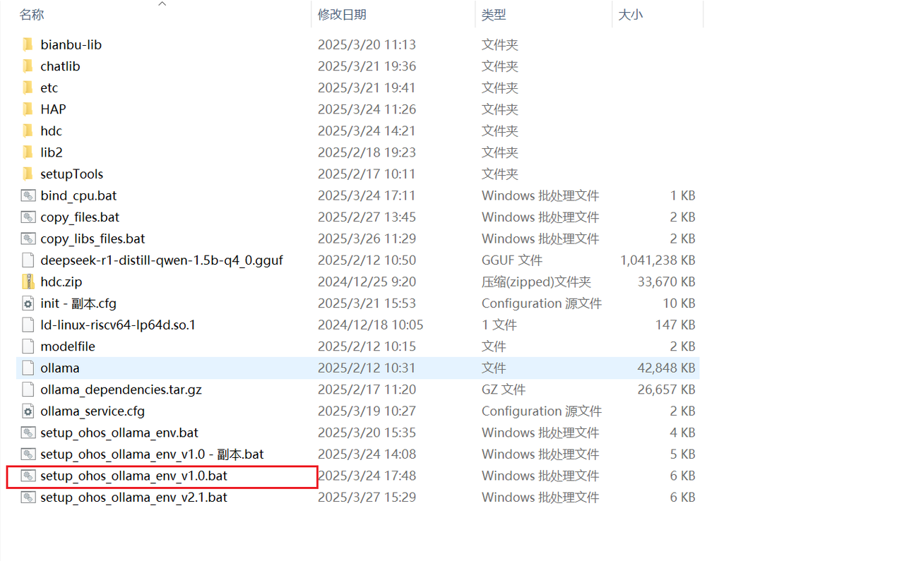
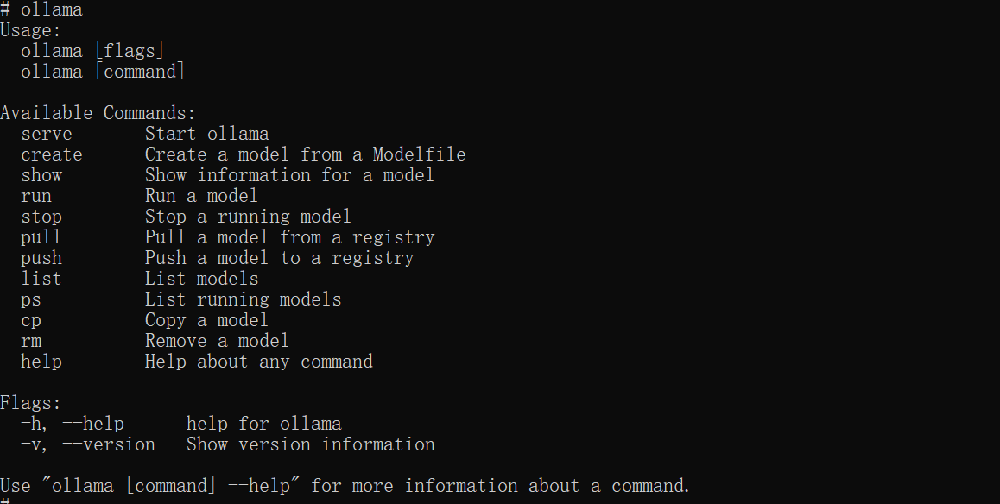
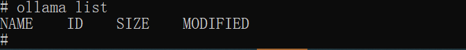
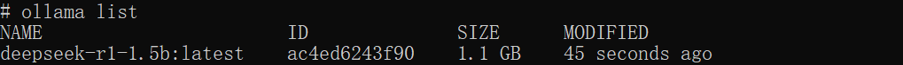
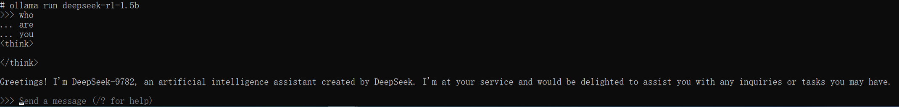
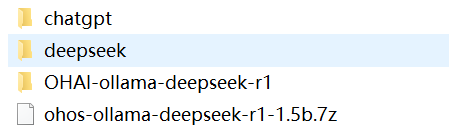
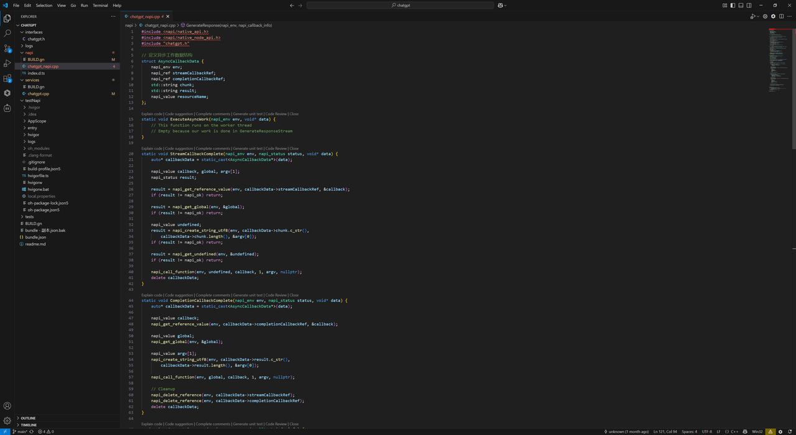
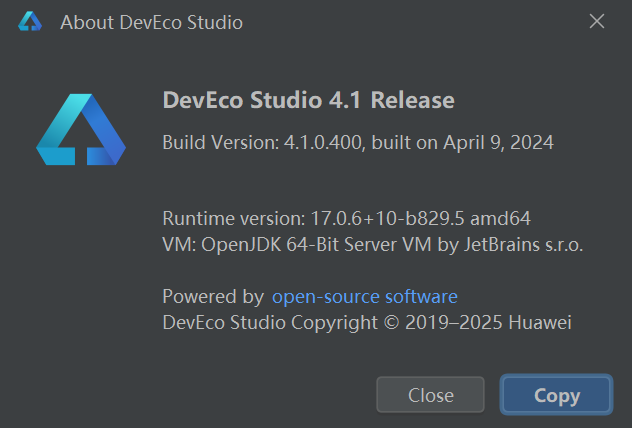
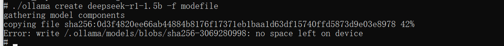

sidebar_position: 3

# 修订记录

| 修订版本 | 修订日期    | 修订说明       |
|----------|-------------|--------------|
| 001      | 2025-03-28  | 初始版本      |
| 002      | 2025-04-12  | 优化格式      |
| 003      | 2025-08-15  | CIE修改版本   |

---

# 1. 前置准备
参考编译文档完成系统编译、烧录：<a  href ="https://developer.spacemit.com/documentation?token=OQRQwIzlAiPAxikkNSJcKvFJnQf"> K1 OH5.0下载编译烧录说明</a>

## 1.1. ollama+deepseek资源准备
下载地址：<a  href ="https://archive.spacemit.com/tools/openharmony/ai/">点我下载</a>

```
deepseek-r1-distill-qwen-1.5b-q4_0.gguf
Modelfile
Ollama
```

### deepSeek-r1-distill-qwen-1.5b-q4_0.gguf
经过压缩和优化的模型文件。它使用GGUF格式，这是一种专为高效推理和压缩设计的格式。这种格式可以在资源受限的环境中高效运行，例如在嵌入式设备或移动设备上。

### modefile
定义了如何配置和使用 deepseek-r1-distill-qwen-1.5b-q4_0.gguf 模型文件。

### ollama
运行和管理各种机器学习模型。它支持多个模型版本和格式，包括**DeepSeek**系列模型。通过**Ollama**，你可以方便地部署、运行和管理**DeepSeek-R1-Distill-Qwen-1.5B-Q4_0.gguf**模型。

## 1.2. 环境和工具准备
1. MUSE Paper及电源一套
2. type-c线（用于烧录和hdc连接）
3. Windows系统端hdc（用于和板子之间传输文件）
4. IDE（DevEco 4.0）
5. K1 OH5.0编译构建环境

# 2. 安装ollama+deepseek-r1-1.5b
为了让开发者快速体验，提供了一键打包安装的安装包。

## 2.1. 用type-c线连接Windows系统和Muse Paper
 确认hdc shell可以连接MUSE Paper

```
D:\>hdc list targets
0123456789ABCDEF
```

## 2.2. 把安装包下载到Windows电脑，解压到任意位置
下载地址：<a  href ="https://archive.spacemit.com/tools/openharmony/ai/">点我下载</a>（前面已下载，请忽略），内部包括安装包、二次开发所需要的程序和开发手册等。

### 2.2.1. 一键自动安装deepseek
双击图中的红色圈住的安装脚本：**setup_ohos_ollama_env_v1.0.bat**， 给OH安装所有LLM的依赖库和应用程序:



### 2.2.2. 运行调试
安装完后，应用就可以进行LLM的问答了。
- 运行ollama，显示如下图表示ollama正常工作：



- list为空，表示模型没有安装，需要加载大模型



- 加载大模型


- 再查看模型列表



- 在命令行运行大模型进行对话



- 打开OH 的HAP程序


- 测试HAP的使用界面


# 3. 二次开发

## 3.1. 开发环境准备
- OH系统开发：VSCode + ubuntu Linux server
- HAP开发：DevEco 4.0 【deveco-studio-4.1.0.400.exe】
- 需要开发文件：<a  href ="https://archive.spacemit.com/tools/openharmony/ai/">点我下载</a>（前面已下载，请忽略）
  - chatgpt: oh chatgpt lib代码 + testNAPI 代码
  - deepseek ：演示HAP 代码



## 3.2. OH系统构建
将chatgpt文件夹放到**oh5.0\foundation\communication\chatgpt**目录 ，配置好模块编译配置，就可以编译出对应的库。这个库是用于给上层HAP提供访问ollama 接口的。

### 3.2.1. 编辑开发代码
根据自己的需求，修改代码。



### 3.2.2. 编译镜像
命令如下：
```
./build.sh --product-name musepaper2 --ccache --prebuilt-sdk
```
与本工程相关的两个库为：
- libchatgpt_napi.z.so
- libchatgpt_core.z.so

新编译的镜像包含这两个so，可以烧录镜像，也可以用hdc file send命令推送进去，如下：
```
hdc file send libchatgpt_napi.z.so /lib64/module/
hdc file send libchatgpt_core.z.so /lib64/
```

## 3.3. HAP测试工程
OH5.0\foundation\communication\chatgpt\testNapi主要用于二次开发者参考开发自己的AI 大模型应用，用下面版本DevEco打开工程编译，编出测试所需testNapi HAP，可以用于测试和帮助开发自己的LLM应用。



## 3.4. 开发调试

### 3.4.1. 查看日志
 - hdc shell higlog | grep Chatgpt
 - hdc shell hilog | grep Index
 - 设置ollama debug： 
   - export OLLAMA_DEBUG=1    //可输出日志
   - export OLLAMA_HOST='0.0.0.0'  //可外部访问OLLAMA

```
02-28 12:35:58.260  4086  4086 I C01650/ChatGPT: ChatGPT instance created
02-28 12:35:58.260  4086  4086 I C01650/ChatGPT: Generating streaming response for input: who are you
02-28 12:35:58.261  4086  7595 I C01650/ChatGPT: Request payload: {"model":"deepseek-r1-1.5b","prompt":"who are you","stream":true}
02-28 12:35:58.262  4086  7595 I C01650/ChatGPT: Making request to Ollama API at http://localhost:11434/api/generate
02-28 12:35:58.266  4086  7595 I C01650/ChatGPT: CURL request completed after 1 attempts
02-28 12:35:58.267  4086  7595 I C01650/ChatGPT: Request completed successfully
```

## 3.5. 演示HAP工程
同样使用DevEco Studio 4.1 Release打开对应代码工程，编译演示HAP。


# 4. oh+ollama+deepseek设计说明 

## 4.1. 架构
1. 前端层(ArkTS)
    - 界面和业务
2. 服务层 (ArkTS)
    - 跨NAPI回调实现 (ArkTS ↔ OS Native)
    - 回调注册和管理
    - 业务逻辑、API交互和数据处理
3. NAPI 层
    - JavaScript/TypeScript与C++的接口
    - 参数解析和传递
    - 回调注册
4. C++ 实现层
    - 核心功能及本地API交互
    - napi_async_work实现（防止主线程阻塞  导致app主线工作线程发生block crash）
    - 实现跨napi的callback（ arkts <---> os native ）
    - ollama集成
    - deepSeek集成

## 4.2. llm(chatgpt) 子系统部件 设计&实现
- ChatGPTService使用单例
- C++ ChatGPT类使用单例
- 异步处理
  - NAPI层使用napi_async_work
  - C++层使用std::thread
  - 智能指针防止内存泄漏，增加健壮性，替代new
  - UI层使用实时回调
  - 流式stream处理
  - 详细日志跟踪

### 4.2.1. 调用流程
1. 用户在 UI 输入文本 → 触发 onClick 事件
2. ChatGPTService 调用 NAPI 模块的 generateResponse
3. NAPI 层转换参数，创建异步工作
4. C++ 层执行 HTTP 请求，通过回调返回结果
5. 结果通过回调链传回前端显示，前端实时渲染


### 4.2.2. chatgpt_napi.cpp 设计
数据结构：
```
struct AsyncCallbackData {
    napi_env env;                    // NAPI 环境
    napi_ref streamCallbackRef;      // 流式回调引用
    napi_ref completionCallbackRef;  // 完成回调引用
    std::string chunk;               // 数据块
    std::string result;              // 结果
    napi_value resourceName;         // 资源名称
};
```
回调处理
- StreamCallbackComplete：处理流式数据回调，当有数据chunk出现进行处理
  - 获取回调函数引用
  - 创建参数数组
  - 调用 JavaScript 回调函数
  - 清理资源
- CompletionCallbackComplete：处理完成回调，当处理完成回调处理
  - 类似流式回调的处理流程
  - 额外清理所有回调引用

#### 主要接口函数
```
napi_value GenerateResponse(napi_env env, napi_callback_info info) {
    // 获取参数
    // 创建回调引用
    // 设置异步工作
    // 调用本地方法
}
```
模块初始化
```
napi_value Init(napi_env env, napi_value exports) {
    // 注册模块方法
    napi_property_descriptor desc[] = {
        { "generateResponse", nullptr, GenerateResponse, nullptr, nullptr, nullptr, 
            napi_default, nullptr }
    };
    napi_define_properties(env, exports, 1, desc);
    return exports;
}

NAPI_MODULE(chatgpt_napi, Init)
```

代码流程：
- 模块初始化
```
NAPI_MODULE(chatgpt_napi, Init)  // 注册模块
↓
Init(napi_env env, napi_value exports)  // 初始化函数
↓
napi_define_properties  // 注册 generateResponse 方法

ChatGPT初始化：
ChatGPT::ChatGPT()
↓
std::call_once(initFlag, [this]() {
    InitializeCurl()  // CURL 全局初始化
})
```
UI 层触发：
```
// Index.ets 中的点击事件
this.chatGPTService.generateResponseStream(
    this.userInput,
    (chunk: string) => { this.response += chunk },
    (result: string) => { this.isLoading = false }
)
```
- 服务层处理：
```
// ChatGPTService.ets
public generateResponseStream(input: string, streamCallback, completionCallback): void {
    this.nativeChatGPT.generateResponse(input, streamCallback, completionCallback)
}
```
- NAPI 层转换：
```
// chatgpt_napi.cpp
napi_value GenerateResponse(napi_env env, napi_callback_info info) {
    // 参数转换
    // 创建异步工作
    OHOS::Communication::ChatGPT::GetInstance().GenerateResponseStream(
        input, streamCallback, completionCallback);
}
```
- C++ 核心实现：
```
// chatgpt.cpp
void ChatGPT::GenerateResponseStream(
    const std::string& input,
    StreamCallback streamCallback,
    CompletionCallback completionCallback) {
    // 执行 HTTP 请求
    // 处理流式响应
}
```

# 5. FAQ

## 5.1. 保证推理CPU资源不被强占，需要绑定消耗CPU的几个进程
```
taskset -p 240 $(pidof render_service) 
taskset -p 240 $(pidof com.example.deepseek) 
taskset -p 240 $(pidof com.example.testnapi) 

参数说明：
240 (十六进制0xf0 , 二进制 11110000) 表示 CPU 4-7
命令说明：
taskset -p 240 $(pidof render_service)
pidof render_service： 找到对应线程的线程ID（PID）
taskset -p 240 [PID] 绑定进程运行的CPU 240（二进制表示：11110000）

如果要产品化可以调用 sched_setaffinity() 函数来设置CPU的绑定
int sched_setaffinity(pid_t pid, size_t cpusetsize, const cpu_set_t *mask);
```

## 5.2. 如何导出ollama的日志


## 5.3. MUSE Paper经常熄屏
设置屏幕不熄屏
```
power-shell setmode 602
```

## 5.4. ollama无法运行
可能缺少了**ld-linux-riscv64-lp64d.so.1**
```
/lib/ld-linux-riscv64-lp64d.so.1

把这个文件拷贝的ohos的对应目录, 赋予执行权限 chmod +x /lib/ld-linux-riscv64-lp64d.so.1
```

## 5.5. 空间不够



解决方法： 把这个 /.ollama 目录链接到 /data/deepseek/.ollama
```
ln -s /data/deepseek/.ollama /.ollama
```

## 5.6. Windows命令行下面法输入中文和显示中文调试
```
设置CMD支持中文<: 在windows console 执行>
  让CMD Console支持中文输入与显示：
  chcp 65001:
  
chcp 是 “Change Code Page” 的缩写，用于更改当前控制台的代码页。65001 代表 UTF - 8 编码。
执行此命令后，CMD 窗口会切换到 UTF - 8 编码，此时就能正常显示和输入中文了。 
```
