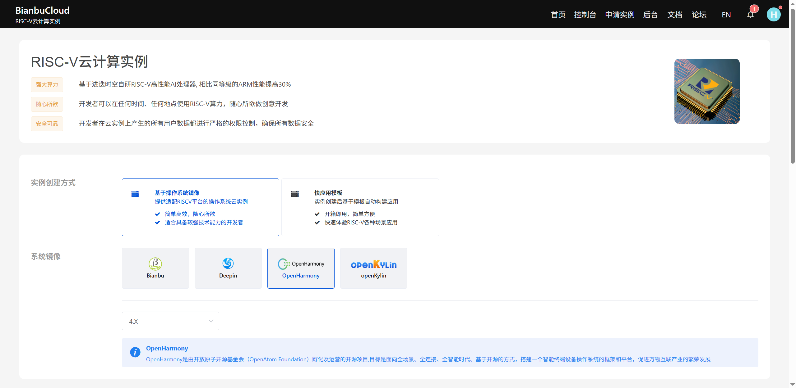
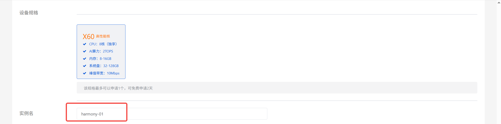
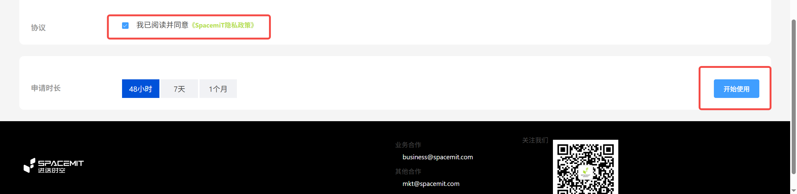
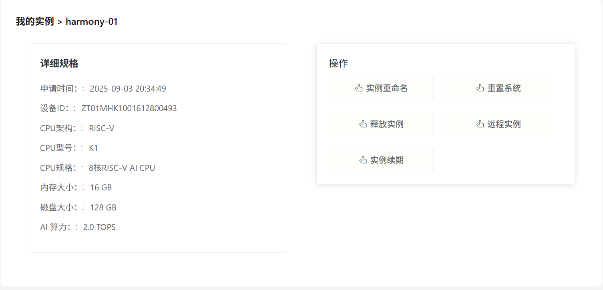
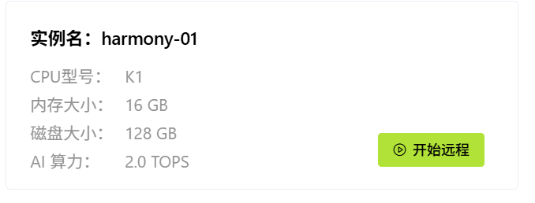
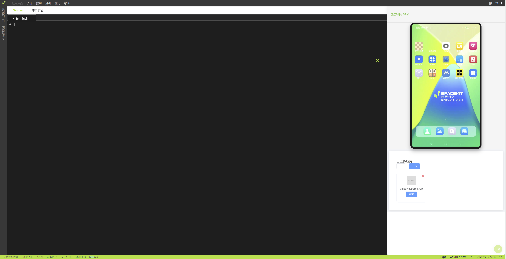
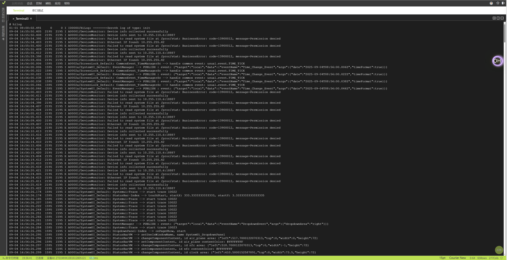
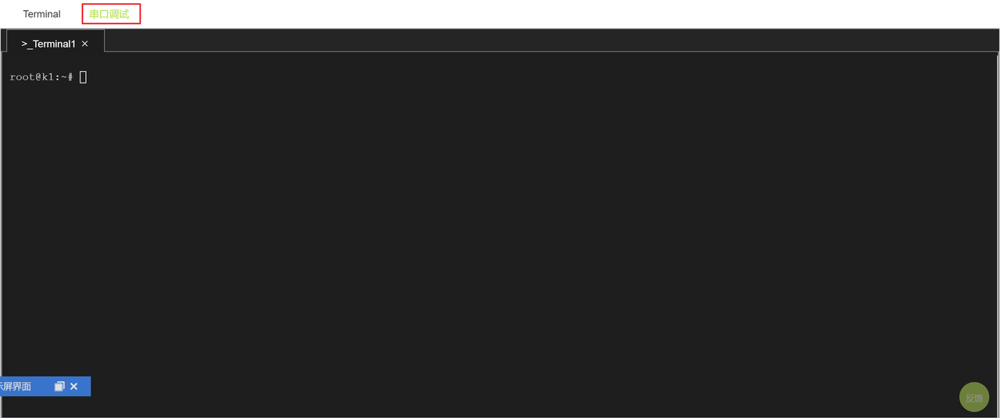
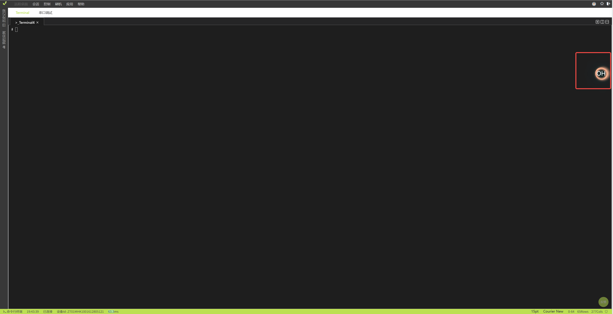
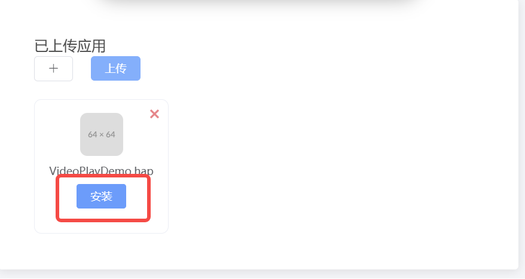

sidebar_position: 4

# 1. 注册和登录
浏览器进入登录地址https://gdriscv.com/，
或手机扫描二维码(推荐使用电脑登录)：

进入登录界面后如果没有账号，点击立即注册，

使用手机号码进行注册，点击"立即注册"按钮

登录成功之后，进入控制台界面：

# 2. 申请实例

点击”申请实例”按钮，跳转到申请实例界面

点击基于操作系统镜像，选择OpenHarmony

修改实例名，也可以保持默认

点击同意协议后，点击“开始使用”按钮即可使用。
申请时长默认即可，参赛对应时长会加入白名单，无需担心时长问题

申请成功后，会自动跳转到控制台查看“我的实例”

点击实例卡片，可查看实例的详细信息，点击"我的实例"可返回实例卡片

备注：如果申请实例失败，提示设备不足，可以选择其他操作系统镜像进行申请
 
# 3. 远程调试
在控制台点击“开始远程”按钮

进入远程工作台，工作台分为三部分，左边是hdc调试，右边是远程桌面和应用管理 

## 3.1 命令行和串口
主界面是hdc命令行交互界面：

输入 hilog 指令可以查看日志：

点击右上角，支持多开和分屏操作：

点击右下角终端字体，可以调整命令行的字体大小和字体格式：

点击“串口调试”可查看实例的串口输出：

## 3.2 远程桌面
点击“OH”按钮可以打开远程桌面

远程桌面上可以使用鼠标进行相关操作，报告划动、点击、长按等操作

## 3.3 应用管理
在远程桌面右下方，可以进行应用文件的上传、安装、删除、查看

应用文件上传，点击上传或者 + 按钮，选择hap应用文件，进行应用文件上传

应用安装，点击安装按钮进行安装

应用文件删除，点击 x 按钮删除应用文件

