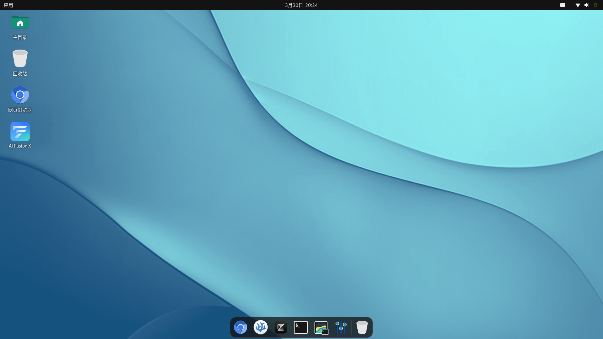

sidebar_position: 2

# 1. 简介

Bianbu Star是基于进迭时空 [Bianbu OS](https://bianbu.spacemit.com/) 发布的融合桌面操作系统，集成定制应用和服务，旨在给用户提供更流畅、更兼容和更简洁的体验。

# 2. 系统特点

- 针对RISC-V进行深度优化和适配
- 自适应兼容多种硬件板型
- 融合进迭时空AIEngine，AI开箱即用
- 开放软件源，用户可定制构建
- 全面支持GPU、VPU、G2D等硬件加速
- 支持多种应用开发框架
- 支持OTA系统升级
- 支持EMMC/SSD/SDCARD多种启动方式
- 支持Grub加载多系统启动
- 支持UEFI启动（选择UEFI版本镜像）

# 3. 软件组件

以下是Bianbu Star的组件：

- 应用程序
- 应用框架
- 运行时
- 库
- Linux内核
- U-Boot
- OpenSBI

通过APT软件源管理这些组件的软件包，软件包是标准的debian软件包格式。

## 3.1 应用

以下是系统预装的基础软件：

- GNOME桌面及其基础应用
- Remmina远程桌面
- Chromium浏览器
- VScodium IDE
- Docker
- Zed
- Ai FusionX
- MPV视频播放器
- Cheese相机

## 3.2 框架

**应用框架**

- Electron
- GTK
- QT

**多媒体框架**

- FFmpeg (with Hardware Accelerated)
- GStreamer (with Hardware Accelerated)
- PipeWire

**推理框架**

- OnnxRuntime (with Hardware Accelerated)
- Ollam(with Hardware Accelerated)

## 3.3 运行时

- Python
- Java
- Node.js
- Rust

## 3.4 库

- OpenCV (with RVV Accelerated)
- OpenSSL (with Hardware Accelerated)
- MPP，进迭时空多媒体处理平台，提供C API和sample
- Mesa 3D
- OpenGLES/Vulkan/OpenCL

## 3.5 Linux 内核

Linux内核负责管理处理器和其他硬件资源，提供用户和应用程序与硬件之间的接口。主要功能包括中断和时钟管理、进程管理、内存管理、文件系统管理、设备驱动管理和网络协议栈等，代码在gitee上开源。

版本：6.6

源码：[https://gitee.com/bianbu-linux/linux-6.6](https://gitee.com/bianbu-linux/linux-6.6) (LTS)

## 3.6 U-Boot

U-Boot是一个引导加载程序，负责初始化特定硬件，从介质（如 SD 卡、eMMC、SPI Flash、SSD、网络）加载Linux内核镜像、设备树和初始RAM文件系统，代码在gitee上开源。

版本：u-boot-2022.10

源码：[https://gitee.com/bianbu-linux/uboot-2022.10](https://gitee.com/bianbu-linux/uboot-2022.10)

## 3.7 OpenSBI

OpenSBI是RISC-V架构处理器的监管程序接口的实现，运行在M模式下的固件，提供引导加载程序、hypervisor、操作系统访问硬件的接口，代码在gitee上开源。

版本：1.3

源码：[https://gitee.com/bianbu-linux/opensbi](https://gitee.com/bianbu-linux/opensbi)

#  4. 配套资料

系统配套的说明文档、开发指南可查阅 [进迭时空开发者社区](https://developer.spacemit.com/)。

# 5. 系统烧录

## 5.1 镜像

- Bianbu Star固件地址：[https://archive.spacemit.com/image/k1/version/bianbu-computer/v2.1.5/bianbu-computer-s1_v2.1.5.zip](https://archive.spacemit.com/image/k1/version/bianbu-computer/v2.1.5/bianbu-computer-s1_v2.1.5.zip)

- 镜像版本：v2.1.5

- 支持设备：[MUSE Pi Pro](https://developer.spacemit.com/documentation?token=KHRWwjlZziiObikHeUScjbVEnMg&type=pdf)

## 5.2 刷机工具

使用进迭时空自研的Titan Flasher将固件烧录到开发板，支持Windows和Linux版本。

下载链接：[https://developer.spacemit.com/documentation?token=O6wlwlXcoiBZUikVNh2cczhin5d](https://developer.spacemit.com/documentation?token=O6wlwlXcoiBZUikVNh2cczhin5d)

