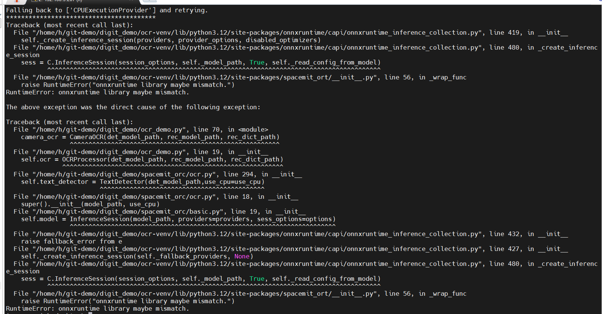
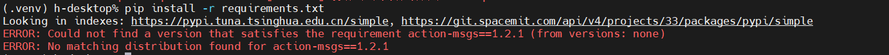

sidebar_position: 14

<!---------------------------------- 软件相关 ---------------------------------->

# 1. vscodium连接失败


**参考**：
1. [b站教程](https://www.bilibili.com/video/BV1Dh5Lz7EQD?buvid=YC4F7CC82F8DD56B4FD6AC6F6FF7187C0A99&from_spmid=search.search-result.0.0&is_story_h5=false&mid=rnn1kaOkAxuNW2GQpPH%2BIw%3D%3D&plat_id=116&share_from=ugc&share_medium=iphone&share_plat=ios&share_session_id=B8E3DF94-1B59-4760-9141-DC092B2F8A58&share_source=COPY&share_tag=s_i&spmid=united.player-video-detail.0.0&timestamp=1747018853&unique_k=f7XIcVl&up_id=3537125114906665&spm_id_from=333.788.videopod.sections&p=8)
2. [论坛](https://forum.spacemit.com/t/topic/253)

如果根据上述教程配置依旧连不上，检查是否板子过热，这会导致系统服务响应慢，有可能导致ssh连接超时，可以等板子“休息”一下再试试。

vscodium有时候在更新以后无法连接上开发板，首先在musepipro上删掉~/.vscodium-server再试一下，如果output显示failed download vscodium-reh-linux-riscv64-1.99.32846.tar.gz，但是在这个目录下能发现一串ID：


则手动下载：

去这个链接https://archive.spacemit.com/ros2/prebuilt/

下载vscodium-reh-linux-riscv64-1.99.32846.tar.gz到~目录下：

下载后，执行下面命令：
```Bash
cd ~/.vscodium-server/bin/49c135149981f1416257ad8fad6c355ef9dad22d
mv ~/vscodium-reh-linux-riscv64-1.99.32846.tar.gz ./
tar -xf vscodium-reh-linux-riscv64-1.99.32846.tar.gz --strip-components 1
rm -rf vscodium-reh-linux-riscv64-1.99.32846.tar.gz
```

49c135149981f1416257ad8fad6c355ef9dad22d 为 id，在windows的powershell里输入vscodium --version查看
然后在vscodium重新连接即可。

注意：不要升级codium，会导致remote的版本号可能对应不上，这是是指定的codium版本和插件版本：

https://archive.spacemit.com/ros2/prebuilt/VSCodiumSetup-x64-1.99.32846.exe

https://archive.spacemit.com/ros2/prebuilt/vscodium-reh-linux-riscv64-1.99.32846.tar.gz

# 2. python程序调用mipi摄像头提示找不到设备

目前mipi摄像头没有适配python接口，建议使用usb摄像头来跑python程序。

# 3. RISCV有适配的anaconda环境吗？
需要自己去anaconda官网的工具链配置，这个文章可以看看：
[https://blog.csdn.net/huang_k_f/article/details/1308823694](https://blog.csdn.net/huang_k_f/article/details/1308823694)

# 4. 自主训练的模型能否部署到k1运行？

K1不是GPU推理。电脑上训练完导出onnx模型，然后做量化。按照我们的教程 [https://bianbu.spacemit.com/ai/onnxruntime](https://bianbu.spacemit.com/ai/onnxruntime) 就可以推理，你自己电脑上做的gpu模型可能在k1上跑不起来。

# 5. 如何查看机械臂的IP地址？
机械臂的主控板（RV4B/Muse Pi Pro）外接显示屏，打开终端输入 `ifconfig` 命令查看。

# 6. YOLOv8推理格式问题

Q：为什么用 320×320 的图片训练，YOLOv8 推理时会自动调整为 640×640？

A：在未修改 YOLO 官方代码的情况下手动预处理图像，YOLO 在推理过程中会默认将输入图像调整为 640×640 尺寸。因此，如需自定义输入分辨率，需显式指定 `imgsz` 参数，或修改模型配置。

# 7. K1集群板上如何搭建K3S

Q：k3s master节点不支持RISCV？


A：参考 [K1集群板上搭建K3S](https://www.bit-brick.com/zh/2025/04/23/k1集群板上搭建k3s/) 来设置

# 8. k1如何运行x86/arm64.so文件

Q：请问一下x86，arm64等的.so文件，代码怎么转换成能在risc-v跑的

A：无法直接运行，需要找到目标库的源码重新用risc-v的工具链编译

# 9. 工业相机远程连接

Q：机器人的工业相机能不能通过网络进行远程连接

A：可以远程连接，需要自己编写脚本通过网络推流来获取视频

# 10. WIFI连不上怎么回事

Q：开发板无法正常连接wifi，命令行连接也失效

A：可能是错误修改了系统内核，建议尝试重刷系统

# 11. onnx文件无法识别

Q：onnx文件无法识别，是不是安装onnxruntime时出错

A：有可能。在开发环境终端输入命令安装spacemit的onnxruntime库

```
pip install spacemit-ort --index-url https://git.spacemit.com/api/v4/projects/33/packages/pypi/simple
```

# 12. python报错onnxruntime library maybe mismatch



spacemit-ort 和 onnxrutime库冲突导致的，执行下述命令修复：

```Bash
pip uninstall onnxruntime spacemit-ort
pip install spacemit-ort
```

# 13. 有配套的摄像头手眼标定案例吗？

可以参考[大象机器人视觉跟踪的demo](https://github.com/elephantrobotics/Visual_tracking.git)

# 14. python识别文字之后怎么播放出来

参考bianbu robot的 [tts demo](https://bianbu.spacemit.com/brdk/Robot_development/5.2_Feature_Experience/5.2.5_Text_to_Speech)

# 15. SSH远程连接无法启动UI界面

通过 `ssh user@<remote_ip>` 方式连接开发板时，无法直接调用图形界面相关功能，原因是默认 SSH 不会转发图形界面所需的 X11 显示服务。

为了解决此问题，可使用以下命令带上 X11 转发参数登录：

```Bash
ssh -X user@<remote_ip>
```

该命令会启用 X11 转发功能，使开发板上的图形界面通过 PC 本地的 X Server 进行显示，从而一定程度上解决 UI 无法调用的问题。

# 16. 语音控制舵机demo卡机

Q：语音控制舵机程序运行两三次就卡机


A：我们这边（在板子本地、没有通过SSH）测试运行很流畅，没有出现卡机状况。请确保舵机和ASR单独测试通过，参考：1. [外设模块参考说明](https://active.spacemit.com/doc/RISC-V%E6%AF%94%E8%B5%9B/03_%E8%93%9D%E6%A1%A5%E6%9D%AF%E6%AF%94%E8%B5%9B%E4%BA%A7%E5%93%81%E5%8C%85/05_%E5%A4%96%E8%AE%BE%E6%A8%A1%E5%9D%97%E5%8F%82%E8%80%83%E8%AF%B4%E6%98%8E) 2. [ASR](https://bianbu.spacemit.com/brdk/Robot_development/5.2_Feature_Experience/5.2.2_Speech_to_Text)

# 17. mobaxterm串口调试报错

Q：Mobaxterm串口调试提示设备连不上


A：请确保：1. 串口线连接正确；2. mobaxterm的时候确保串口波特率和设备号设置正确。可以参考[ Bianbu Robot官方文档](https://bianbu.spacemit.com/brdk/quick_start/1.4_Remote_Access#串口登录)。

# 18. USB麦克风使用

Q：USB麦克风能看见硬件信息但是看不到设备节点，没法采集音频，板载的snd-es8326也没法采集音频。用sounddevice,alaaudio,subprocess调arecord都没法实现音频采集，纯录音都没法，这样的情况该怎么解决呢

A：参考 [Bianbu Robot NLP使用](https://bianbu.spacemit.com/brdk/05_Robot_development/Feature_Experience)

# 19. Bianbu Robot NLP依赖安装失败

Q：想要使用 Bianbu Robot 语音代码的时候根据 requirements.txt 安装依赖失败是怎么回事？



A：依赖里面混入了ROS2的包，请更新依赖文件 [requirements.txt](code/requirements.txt)


<!---------------------------------- 硬件相关 ---------------------------------->

# 20. Muse Pi Pro开发板使用指南怎么获取？

开发文件统一在进迭开发者社区发布。可以通过以下链接访问： 
[进迭开发者社区 - 开发文档](https://developer.spacemit.com/documentation)

# 21. RV4B如何外接UART调试口？

Q：RV4B中的GPIO 47 UART0 TXD、GPIO48 UART0 RXD能不能作为UART调试口？

A：这两个口目前被配置为通信模式，并内嵌在机械臂里面与机械臂进行通信，无法外接，因此大象机械臂myCobot280-RISCV目前无法用串口调试RV4B板子。四个USB可以外接UART，仅满足UART通信需求。

# 22. 机械臂和开发板之间如何通信？

1. 对于大象机械臂myCobot280-RISCV，内部RV4B开发板8号口、10号口被配置为通信模式，这两个口与机械臂进行通信，用户无需做额外处理。


2. 对于自行购买的Muse Pi Pro和机械臂，Muse Pi Pro的8号口、10号口默认被配置为串口调试模式，无法用这两个个口与机械臂通信，需要通过USB外接UART连接机械臂的GND、RX、TX口进行通信。


# 23. 开发板不断重启怎么回事

Q：开发板在接入摄像头、显示屏和散热风扇后，在运行时总是重启，是什么原因？

A：可能是供电电源不稳，开发板负载波动造成的。供电电源应不低于5V 3A