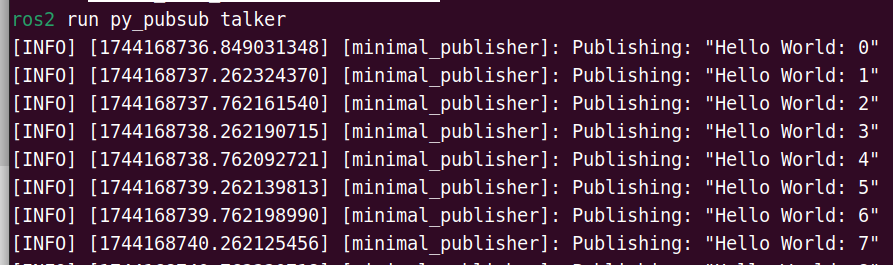
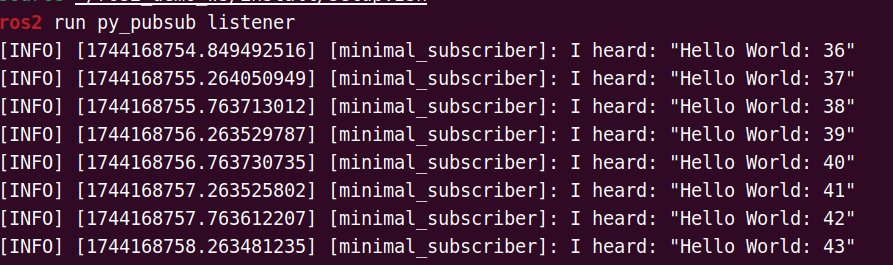
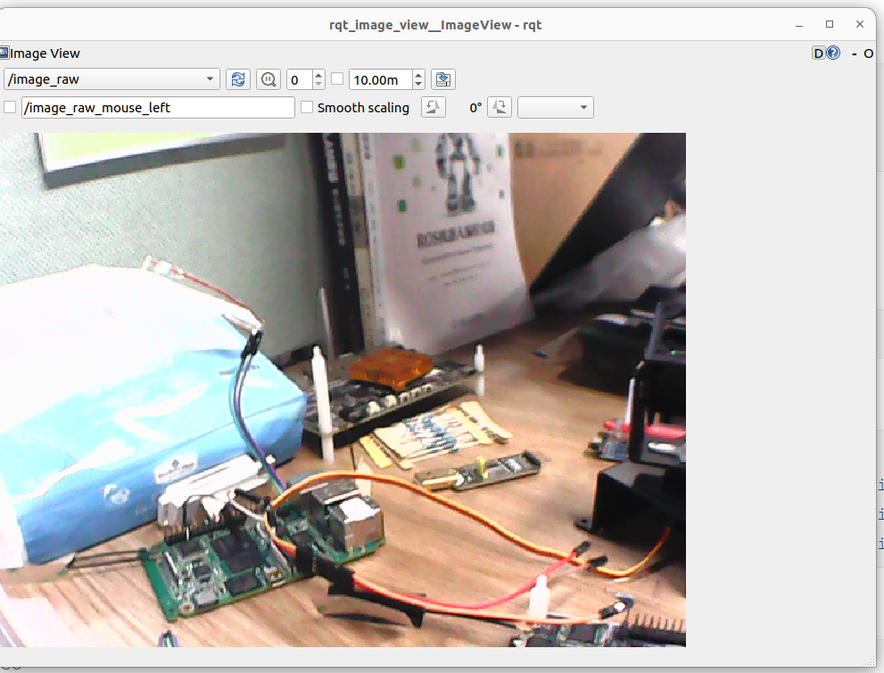

# ROS 2 开发入门指南

## 📦 设置软件源

### 启用进迭时空 ROS 2 存储库

```shell
grep -q '^Suites:.*\bnoble-ros\b' /etc/apt/sources.list.d/bianbu.sources || sudo sed -i '0,/^Suites:/s//& noble-ros/' /etc/apt/sources.list.d/bianbu.sources
```

```shell
if ! dpkg -s bianbu-desktop-lite >/dev/null 2>&1; then
  echo "bianbu-desktop-lite not installed, proceeding..."

  if [ ! -f /etc/apt/preferences.d/noble-ros.pref ]; then
    sudo tee /etc/apt/preferences.d/noble-ros.pref > /dev/null <<EOF
Package: src:opencv
Pin: release o=Spacemit, n=noble-ros
Pin-Priority: 50

Package: src:qtbase-opensource-src
Pin: release o=Spacemit, n=noble-ros
Pin-Priority: 50

Package: src:qtbase-opensource-src-gles
Pin: release o=Spacemit, n=noble-ros
Pin-Priority: 50

Package: src:pyqt5
Pin: release o=Spacemit, n=noble-ros
Pin-Priority: 50
EOF
  else
    echo "/etc/apt/preferences.d/noble-ros.pref already exists, skipping..."
  fi

else
  echo "bianbu-desktop-lite is already installed, skipping preference setup."
fi
```

```shell
sudo apt update
```

## 🛠️ 安装 ROS 2

### 安装开发工具（推荐）

如果需要构建 ROS 包或进行开发，还需要安装开发工具：

```shell
sudo apt update && sudo apt install ros-dev-tools
```

### 安装 ROS-Base 核心包

**包含：** 通信库、消息包、命令行工具（无 GUI 界面）

也可以选择安装 `ros-humble-desktop`，它包含了 rqt 等常用的可视化工具：

```shell
sudo apt install ros-humble-ros-base
```

## 🧪 开发自己的 ROS 2 包

### 1. 创建工作空间

```shell
mkdir -p ~/ros2_demo_ws/src
```

### 2. 获取 ROS 2 环境

```shell
source /opt/ros/humble/setup.bash
```

### 3. 创建 Python 发布者与订阅者

#### 3.1 创建功能包

```shell
cd ~/ros2_demo_ws/src
ros2 pkg create --build-type ament_python --license Apache-2.0 py_pubsub
```

终端会提示已成功创建软件包 `py_pubsub` 及其所需的文件与文件夹。

#### 3.2 编写发布者节点

```shell
cd ~/ros2_demo_ws/src/py_pubsub/py_pubsub
vim publisher_member_function.py
```

粘贴以下代码：

```python
import rclpy                              # 导入 ROS 2 Python 客户端库
from rclpy.node import Node               # 从 rclpy 中导入 Node 类，用于创建节点
from std_msgs.msg import String           # 导入标准的字符串消息类型（std_msgs/String）

# 定义一个继承自 Node 的类，用于创建发布者节点
class MinimalPublisher(Node):

    def __init__(self):
        super().__init__('minimal_publisher')          # 初始化父类，并设置节点名称为 "minimal_publisher"
        self.publisher_ = self.create_publisher(       # 创建一个发布者，发布消息类型为 String
            String,                                    # 消息类型为 std_msgs/String
            'topic',                                   # 主题名称为 "topic"
            10                                         # 队列大小为10，缓冲待发送的消息
        )
        timer_period = 0.5                             # 定时器周期设置为0.5秒
        self.timer = self.create_timer(                # 创建定时器，每0.5秒调用一次回调函数
            timer_period,
            self.timer_callback
        )
        self.i = 0                                      # 定义一个计数器，用于在消息中加入序号

    def timer_callback(self):
        msg = String()                                  # 创建一个 String 类型的消息对象
        msg.data = 'Hello World: %d' % self.i           # 设置消息内容，包含当前计数值
        self.publisher_.publish(msg)                    # 发布消息到 "topic"
        self.get_logger().info('Publishing: "%s"' % msg.data)  # 在终端输出当前发布的消息内容
        self.i += 1                                     # 计数器递增，用于下一条消息

# main 函数是程序入口点
def main(args=None):
    rclpy.init(args=args)                               # 初始化 rclpy

    minimal_publisher = MinimalPublisher()              # 创建 MinimalPublisher 节点对象

    rclpy.spin(minimal_publisher)                       # 保持节点运行，监听回调（比如定时器回调）

    minimal_publisher.destroy_node()                    # 节点关闭前，销毁节点资源
    rclpy.shutdown()                                    # 关闭 rclpy 系统

# 如果作为主程序运行，则调用 main() 函数
if __name__ == '__main__':
    main()
```

保存并退出。

#### 3.3 添加依赖项

```shell
cd ~/ros2_demo_ws/src/py_pubsub
vim package.xml
```

在 `<license>Apache-2.0</license>` 之后添加以下依赖项：

```xml
<exec_depend>rclpy</exec_depend>
<exec_depend>std_msgs</exec_depend>
```

保存文件。

#### 3.4 添加入口点

```shell
cd ~/ros2_demo_ws/src/py_pubsub
```

打开 `setup.py`，确保 `maintainer`、`maintainer_email`、`description` 和 `license` 字段与 `package.xml` 一致：

```python
maintainer='YourName',
maintainer_email='you@email.com',
description='Examples of minimal publisher/subscriber using rclpy',
license='Apache-2.0',
```

在 `entry_points` 的 `console_scripts` 中添加：

```python
entry_points={
        'console_scripts': [
                'talker = py_pubsub.publisher_member_function:main',
        ],
},
```

#### 3.5 检查 `setup.cfg`

`setup.cfg` 的内容应自动正确填充如下：

```ini
[develop]
script_dir=$base/lib/py_pubsub
[install]
install_scripts=$base/lib/py_pubsub
```

这告诉 setuptools 将可执行文件放在 `lib` 目录下，`ros2 run` 会在那里查找它们。

接下来创建订阅者节点，这样就能看到完整的发布/订阅工作流程。

#### 3.6 编写订阅者节点

```shell
cd ~/ros2_demo_ws/src/py_pubsub/py_pubsub
vim subscriber_member_function.py
```

粘贴以下代码：

```python
import rclpy                            # 导入 ROS 2 的 Python 客户端库
from rclpy.node import Node             # 从 rclpy.node 中导入 Node 类，用于定义节点
from std_msgs.msg import String         # 导入标准消息类型 String（std_msgs/String）

# 定义一个继承自 Node 的类：MinimalSubscriber（最小订阅者示例）
class MinimalSubscriber(Node):

    def __init__(self):
        super().__init__('minimal_subscriber')   # 初始化父类，并设置节点名称为 "minimal_subscriber"

        # 创建一个订阅者，订阅名为 'topic' 的主题，消息类型为 String，队列大小为 10
        self.subscription = self.create_subscription(
            String,                              # 消息类型为 std_msgs/String
            'topic',                             # 订阅的主题名称为 'topic'
            self.listener_callback,              # 接收到消息时回调函数
            10                                   # 消息队列大小
        )

        self.subscription  # 防止变量未使用的警告（可有可无，起提示作用）

    # 回调函数：每当收到一条消息，就会调用这个函数
    def listener_callback(self, msg):
        # 打印收到的消息内容到终端
        self.get_logger().info('I heard: "%s"' % msg.data)

# main() 函数是程序的入口
def main(args=None):
    rclpy.init(args=args)                          # 初始化 ROS 2 客户端功能

    minimal_subscriber = MinimalSubscriber()       # 创建 MinimalSubscriber 节点实例

    rclpy.spin(minimal_subscriber)                 # 保持节点运行，监听消息并调用回调函数
    # 显式销毁节点资源（可选，一般在程序退出前调用）
    minimal_subscriber.destroy_node()
    rclpy.shutdown()                               # 关闭 ROS 2 客户端功能

# 如果是主程序执行，则调用 main 函数
if __name__ == '__main__':
    main()
```

订阅者节点的代码几乎与发布者相同。构造函数使用与发布者相同的参数创建一个订阅者。发布者和订阅者使用的主题名称和消息类型必须匹配，以便它们能够进行通信。

订阅者的构造函数和回调函数不包含任何计时器定义，因为它不需要。它的回调函数在接收到消息后立即被调用。

由于此节点与发布者具有相同的依赖项，因此无需在 `package.xml` 中添加任何新内容。 `setup.cfg` 文件也可以保持不变。

#### 3.7 添加订阅者入口点

```shell
cd ~/ros2_demo_ws/src/py_pubsub
```

重新打开 `setup.py` 并在发布者入口点下方添加订阅者节点的入口点。现在 `entry_points` 字段应如下所示：

```python
entry_points={
        'console_scripts': [
                'talker = py_pubsub.publisher_member_function:main',
                'listener = py_pubsub.subscriber_member_function:main',
        ],
},
```

保存文件。至此发布/订阅系统已经完成。

#### 3.8 编译并运行

**编译：**

```shell
cd ~/ros2_demo_ws/
source /opt/ros/humble/setup.bash
colcon build --packages-select py_pubsub
```

**启动发布者（当前终端）：**

```shell
source /opt/ros/humble/setup.bash
source ~/ros2_demo_ws/install/setup.bash
ros2 run py_pubsub talker
```

终端会每 0.5 秒发布一条消息，类似下图：



**启动订阅者（新建一个终端）：**

```shell
source /opt/ros/humble/setup.bash
source ~/ros2_demo_ws/install/setup.bash
ros2 run py_pubsub listener
```

订阅者会持续接收发布者的消息并打印到控制台，类似下图：



## 📷 使用已有的功能包

### 使用 usb_cam 调用 USB 相机

#### 安装

```shell
sudo apt update
sudo apt install ros-humble-usb-cam
source /opt/ros/humble/setup.bash
```

#### 查看 USB 相机设备号

**未接入 USB 相机前：**

```bash
ls /dev/video*
```

显示结果：

```
/dev/video0   /dev/video11  /dev/video14  /dev/video17  /dev/video2  /dev/video5   /dev/video6  /dev/video9
/dev/video1   /dev/video12  /dev/video15  /dev/video18  /dev/video3  /dev/video50  /dev/video7  /dev/video-dec0
/dev/video10  /dev/video13  /dev/video16  /dev/video19  /dev/video4  /dev/video51  /dev/video8
```

**接入 USB 相机后：**

```bash
ls /dev/video*
```

显示结果：

```
/dev/video0   /dev/video11  /dev/video14  /dev/video17  /dev/video2   /dev/video3  /dev/video50  /dev/video7  /dev/video-dec0
/dev/video1   /dev/video12  /dev/video15  /dev/video18  /dev/video20  /dev/video4  /dev/video51  /dev/video8
/dev/video10  /dev/video13  /dev/video16  /dev/video19  /dev/video21  /dev/video5  /dev/video6   /dev/video9
```

多出的 `/dev/video20`、`/dev/video21` 即为 USB 相机的设备节点。

#### 启动 USB 相机节点

```shell
source /opt/ros/humble/setup.bash
ros2 run usb_cam usb_cam_node_exe --ros-args -p video_device:="/dev/video20"
```

启动成功后会看到类似以下输出：

```
[INFO] [1744172544.075291448] [usb_cam]: camera_name value: default_cam
[WARN] [1744172544.075853419] [usb_cam]: framerate: 30.000000
[INFO] [1744172544.091075111] [usb_cam]: using default calibration URL
[INFO] [1744172544.091334950] [usb_cam]: camera calibration URL: file:///home/zq-pi3/.ros/camera_info/default_cam.yaml
[ERROR] [1744172544.091760085] [camera_calibration_parsers]: Unable to open camera calibration file [/home/zq-pi3/.ros/camera_info/default_cam.yaml]
[WARN] [1744172544.091881755] [usb_cam]: Camera calibration file /home/zq-pi3/.ros/camera_info/default_cam.yaml not found
Could not retrieve device capabilities: `/dev/v4l-subdev0`
[INFO] [1744172544.235730013] [usb_cam]: Starting 'default_cam' (/dev/video20) at 640x480 via mmap (yuyv) at 30 FPS
[swscaler @ 0x2ad6488640] No accelerated colorspace conversion found from yuv422p to rgb24.
This device supports the following formats:
    YUYV 4:2:2 640 x 480 (30 Hz)
    YUYV 4:2:2 640 x 480 (25 Hz)
    YUYV 4:2:2 640 x 480 (20 Hz)
    YUYV 4:2:2 640 x 480 (15 Hz)
    YUYV 4:2:2 640 x 480 (10 Hz)
    YUYV 4:2:2 640 x 480 (5 Hz)
[INFO] [1744172544.255035217] [usb_cam]: Setting 'brightness' to 50
unknown control 'white_balance_temperature_auto'

[INFO] [1744172544.288086828] [usb_cam]: Setting 'white_balance_temperature_auto' to 1
[INFO] [1744172544.288310083] [usb_cam]: Setting 'exposure_auto' to 3
unknown control 'exposure_auto'

[INFO] [1744172544.303411938] [usb_cam]: Setting 'focus_auto' to 0
```

#### 在 PC 上查看图像

请确保你的 PC 已安装 ROS 2 Humble（[安装教程](https://docs.ros.org/en/humble/Installation/Ubuntu-Install-Debs.html)）。

```shell
source /opt/ros/humble/setup.bash
ros2 run rqt_image_view rqt_image_view
```

在弹出的界面中选择对应的图像话题即可查看：



## 📝 小结

本教程仅安装了 ROS 2 Humble 的最小基础包。如果在开发中需要更多功能包，可以使用以下命令按需安装，避免浪费存储空间：

```shell
sudo apt install ros-humble-<package-name>
```

你可以参考 ROS 2 官方教程在 K1 开发板上运行更多示例：  
👉 [https://docs.ros.org/en/humble/Tutorials.html](https://docs.ros.org/en/humble/Tutorials.html)

> ⚠️ **注意：** 请使用本文档的方法配置源，不要直接使用官方的 ROS 2 安装指引。