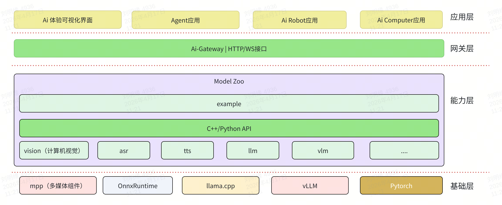

# SpacemiT AI SDK

## 1. 项目简介

SpacemiT AI SDK是面向进迭时空 K 系列芯片打造的 AI 应用开发套件。它在保留原有多模态能力组件的基础上，进一步向上承接 Agent、AI Robot、AI Computer 等应用形态，提供统一的能力封装与接口接入方式，包括：

- **计算机视觉（vision）**：检测/分类/分割/跟踪/人脸/姿态等，覆盖示例包括 `resnet`、`yolov8`、`yolov11`、`yolov8_seg`、`yolov8_pose`、`bytetrack`、`ocsort`、`yolov5-face`、`arcface`、`emotion` 等
- **语音**：`VAD`（语音活动检测）、`ASR`（语音识别）、`TTS`（语音合成）、`Voiceprint`（声纹识别），提供可直接运行的 demo，便于单模块验证与联调
- **自然语言（LLM）**：OpenAI 兼容接口对接（如 `llama-server`），提供 `llm_chat` 等示例便于快速体验与集成
- **强化学习（RL）**：面向机器人策略推理，提供 YAML 配置解析、观测组装、ONNX 推理与动作映射能力
- **统一服务接入（gateway）**：基于 ASR/TTS/VAD/Vision/LLM 等基础能力之上封装统一的 HTTP/WS API、模型管理与前端控制台




AI SDK 的各独立组件都封装了一层通用 API 接口，用于屏蔽底层复杂业务细节，让用户专注于上层应用开发。当前 AI SDK 对外主要提供两类接入方式：

- **C++/Python 接口**：面向本地集成、二次开发与嵌入式部署，适合直接调用各能力组件 SDK，构建定制化应用。
- **HTTP/WS 接口**：由 gateway 层在基础能力组件之上统一对外暴露，适合跨语言、跨进程或分布式场景接入，便于将底层 AI 能力快速接入上层业务系统。

> **说明**：本文档从「顶层应用」视角提供 SpacemiT AI SDK 的导航与快速上手。各组件仍在持续迭代，文档会随之更新，敬请关注。

## 2. 平台支持情况

|      平台 & 系统       |       是否支持     |
|-----------------------|-----------------------|
| K1 Buildroot          | ✅ 支持               |
| K1 OpenHarmony     | ❌ 不支持              |
| K1 Bianbu LXQT/GNOME    | ✅ 支持              |
| K3 Buildroot          | ✅ 支持               |
| K3 OpenHarmony     | ❌ 不支持              |
| K3 Bianbu LXQT/GNOME  | ✅ 支持                |

## 3. 构建编译

### 3.1 获取代码

本仓库使用 Git Submodule 管理各组件源码，推荐递归拉取：

```bash
git clone --recurse-submodules https://github.com/spacemit-com/ai-sdk.git
# 或 SSH
# git clone --recurse-submodules git@github.com:spacemit-com/ai-sdk.git
```

如果你已经 clone 了主仓库但没拉子仓库：

```bash
cd ai-sdk
git submodule update --init --recursive
```

### 3.2 一键编译

本仓库以 submodule 方式聚合各组件源码；

```bash
# source环境变量
source build/envsetup.sh

# 一键编译应用
# 第一次编译时间会长一点，编译会自动安装各组件依赖，请耐心等待
m
```

构建产物通常会安装到 `output/staging`（以 SDK 工程为准）。

### 3.3 单独编译基础组件

如果你只想在 SDK 中**单独编译某个基础能力组件**，可以进入对应目录执行 `mm`（同样需要先 `source build/envsetup.sh`）：

```bash
source build/envsetup.sh

cd asr && mm
# 或
cd vision && mm
cd tts && mm
cd vad && mm
cd llm && mm
cd voiceprint && mm
cd rl && mm
```

Gateway 是统一服务接入层，包含 Python 服务、HTTP/WS API、前端控制台与 Debian 打包流程，不建议简单等同为一个 `mm` 编译的算法组件。Gateway 的安装与启动方式见 [5. Gateway统一HTTP/WS接入层](#5-gateway-统一-httpws-接入层)

## 4. 基础能力组件示例

> 说明：以下示例默认你已经按上文完成一键编译（示例可执行文件会统一安装到 `output/staging`）。

### 4.1 计算机视觉

**步骤1：下载模型**

```bash
# 下载所有 vision 示例模型（会放到 ~/.cache/models/vision/ 下面）
bash vision/scripts/download_all_models.sh
```

**步骤2：下载资源文件（图片/视频）**

```bash
# 下载示例用图片/视频资源（会放到 ~/.cache/assets/ 下面）
bash vision/scripts/download_assets.sh
```

默认目录：

- 模型：`~/.cache/models/vision/`
- 资源：`~/.cache/assets/`

**步骤3：运行示例**

以下为 `vision/examples/` 下**全部示例**的运行命令（C++，执行过 `m` 后在SDK根目录可直接运行）：

```bash
# 人脸识别（相似度）
arcface vision/examples/arcface/config/arcface.yaml

# 人脸检测
yolov5-face vision/examples/yolov5-face/config/yolov5-face.yaml

# 手势检测
yolov5_gesture vision/examples/yolov5_gesture/config/yolov5_gesture.yaml

# 目标检测
yolov8 vision/examples/yolov8/config/yolov8.yaml
yolov11 vision/examples/yolov11/config/yolov11.yaml

# 姿态估计
yolov8_pose vision/examples/yolov8_pose/config/yolov8_pose.yaml

# 实例分割
yolov8_seg vision/examples/yolov8_seg/config/yolov8_seg.yaml

# 图像分类 / 情绪识别
resnet vision/examples/resnet/config/resnet50.yaml
emotion vision/examples/emotion/config/emotion.yaml

# 多目标跟踪（视频/摄像头）
# 以下两个示例是实时画面显示目标跟踪，需要接上屏幕，否则会报错
bytetrack vision/examples/bytetrack/config/bytetrack.yaml
ocsort vision/examples/ocsort/config/ocsort.yaml
```

每个示例的可选参数（如 `--image`、`--video`、`--use-camera`、`--output`、阈值等）请参考对应目录的 README（`vision/examples/*/README.md`），或参阅 [model-zoo-vision README](https://github.com/spacemit-com/model-zoo-vision/blob/main/README.md)。

### 4.2 ASR

**步骤1：下载音频资源（示例音频）**

```bash
mkdir -p ~/.cache/models/assets/audio
cd ~/.cache/models/assets/audio
wget https://archive.spacemit.com/spacemit-ai/model_zoo/assets/audio/001_zh_daily_weather.wav
```

更多音频资源可在 [音频资源目录](https://archive.spacemit.com/spacemit-ai/model_zoo/assets/audio) 按需下载。

**步骤2：运行示例**

```bash
# 识别 wav 文件（示例）
asr_file_demo ~/.cache/models/assets/audio/001_zh_daily_weather.wav
```

### 4.3 TTS

**运行示例**

```bash
# 简单合成（默认参数）
tts_file_demo

# 指定文本与后端（示例）
tts_file_demo -p "你好世界" -l matcha:zh
```

### 4.4 VAD

**运行示例**

```bash
# 内置模拟音频测试
vad_simple_demo
```


### 4.5 LLM

**步骤1：下载模型（GGUF 示例）**

```bash
mkdir -p ~/.cache/models/llm
cd ~/.cache/models/llm
wget https://archive.spacemit.com/spacemit-ai/model_zoo/llm/qwen2.5-0.5b-instruct-q4_0.gguf
```

如需体验更多模型，可查看 [LLM 模型目录](https://archive.spacemit.com/spacemit-ai/model_zoo/llm) 按需下载。

**步骤2：启动 OpenAI 兼容服务并调用示例**

```bash
# 启动服务（8080）
llama-server -m ~/.cache/models/llm/qwen2.5-0.5b-instruct-q4_0.gguf -t 8 --port 8080 &

# 调用 SDK 示例程序
llm_chat "你好" "http://localhost:8080/v1" "qwen2.5-0.5b" "You are a helpful assistant." 256
```

若使用**云端 / 远端 OpenAI 兼容服务**（如 DeepSeek 等），只需将第 2 个参数替换为云端的 `api_base`，并通过环境变量传入 API Key，例如：

```bash
export OPENAI_API_KEY=你的云端key
llm_chat "你好" "https://api.deepseek.com" "deepseek-chat" "You are a helpful assistant." 256
```

### 4.6 Voiceprint

Voiceprint 组件提供说话人识别、说话人验证和嵌入提取能力，默认使用 CamP+（3D-Speaker）模型，模型首次运行时会自动下载到 `~/.cache/models/vp/campplus/`。

**运行示例**

```bash
# 下载示例音频
mkdir -p ~/.cache/models/assets/audio && wget -P ~/.cache/models/assets/audio https://archive.spacemit.com/spacemit-ai/model_zoo/assets/audio/002_en_daily_weather.wav

# 注册说话人
register_speaker -n manbo ~/.cache/models/assets/audio/002_en_daily_weather.wav

# 识别说话人
identify_speaker ~/.cache/models/assets/audio/001_zh_daily_weather.wav
```

更多参数与 C++ 集成方式请参考 [model_zoo_voiceprint README](https://github.com/spacemit-com/model_zoo_voiceprint/blob/main/README.md) 和 [Voiceprint API](https://github.com/spacemit-com/model_zoo_voiceprint/blob/main/API.md)。

### 4.7 RL

RL 组件当前主要用于机器人控制链路中的强化学习策略推理，负责 YAML 配置解析、观测组装、ONNX 推理与动作映射。它面向机器人的运动控制场景，通常与具体机器人应用、策略模型和控制框架配合使用。

强化学习能力的使用方式、运行步骤和机器人控制示例请参考 [强化学习文档](https://www.spacemit.com/community/document/info?lang=zh&nodepath=software/SDK/ros/k3/04-AI%E4%B8%8E%E7%AE%97%E6%B3%95/4.3-%E5%BC%BA%E5%8C%96%E5%AD%A6%E4%B9%A0.md)。

## 5. Gateway 统一 HTTP/WS 接入层

gateway 不是独立的算法能力组件，而是基于 ASR/TTS/VAD/Vision/LLM/Embed/Rerank 等基础能力之上的统一服务封装层。它对外提供 HTTP/WebSocket API、模型管理能力和前端控制台，适合跨语言、跨进程、分布式部署或业务系统集成。

### 5.1 安装与启动

生产部署推荐使用 Debian 包安装：

```bash
sudo apt update
sudo apt install spacemit-ai-gateway
```

安装完成后，两个 systemd 服务会自动启动：

| 服务 | 端口 | 说明 |
|------|------|------|
| `spacemit-ai-gateway` | 18790 | backend HTTP/WebSocket API |
| `spacemit-ai-gateway-frontend` | 8326 | 前端 console 静态站点 |

查看服务状态与日志：

```bash
systemctl status spacemit-ai-gateway
journalctl -u spacemit-ai-gateway -f
```

源码调试时，也可以直接启动 gateway 服务：

```bash
spacemit-ai-gateway
# 或
uvicorn spacemit_ai_gateway.app.main:app --host 0.0.0.0 --port 18790
```

### 5.2 验证

先确认 gateway 服务已经启动：

```bash
curl -s localhost:18790/healthz | jq .
```

准备测试资源：

```bash
mkdir -p ~/.cache/models/assets/audio
wget -O ~/.cache/models/assets/audio/001_zh_daily_weather.wav \
  https://archive.spacemit.com/spacemit-ai/model_zoo/assets/audio/001_zh_daily_weather.wav

wget -O /tmp/vision_test.jpg \
  https://archive.spacemit.com/spacemit-ai/model_zoo/assets/image/006_test.jpg
```

ASR 语音识别：

```bash
curl -s -X POST localhost:18790/v1/asr/recognize \
  -F file=@${HOME}/.cache/models/assets/audio/001_zh_daily_weather.wav \
  -F language=zh | jq .
```

TTS 语音合成：

```bash
curl -s -X POST localhost:18790/v1/tts/synthesize \
  -H 'Content-Type: application/json' \
  -d '{"text":"你好，欢迎使用 SpacemiT AI Gateway","response_format":"wav"}' \
  --output /tmp/gateway_tts.wav
```

LLM 对话：

```bash
curl -s -X POST localhost:18790/v1/chat/completions \
  -H 'Content-Type: application/json' \
  -d '{
    "model":"qwen3-0.6b-q4_0",
    "messages":[{"role":"user","content":"你好，请用一句话介绍你自己"}],
    "stream":false
  }' | jq .
```

Vision 图像检测：

```bash
curl -s -X POST localhost:18790/v1/vision/models/load \
  -H 'Content-Type: application/json' \
  -d '{"model_id":"yolov8n","config_path":"configs/vision/yolov8n.yaml","lazy_load":false}' | jq .

curl -s -X POST localhost:18790/v1/vision/inference \
  -F file=@/tmp/vision_test.jpg \
  -F 'tasks=["detect"]' \
  -F model_id=yolov8n \
  -F render=true \
  -F render_mode=overlay | jq .
```


### 5.3 API

gateway 的接口会随服务能力持续扩展，具体 HTTP/WS 路由、请求参数和返回格式请参考：

- [ai-gateway README](https://github.com/spacemit-com/ai-gateway/blob/main/README.md)

## 6. 应用开发

### 6.1 C++/Python

SpacemiT AI SDK 各组件面向应用侧提供 **稳定的 C++ 头文件入口**（多数为 PIMPL 设计，便于集成与二进制发布），并提供对应的 Python 绑定与示例。应用侧建议先在 SDK workspace 中编译产物到 `output/staging`，再基于 staging 进行联调与部署。

- **vision**：`vision_service.h`（详见 [vision/README.md](https://github.com/spacemit-com/model-zoo-vision/blob/main/README.md) 的「应用开发」章节）
- **ASR**：`asr_service.h`（详见 [asr/README.md](https://github.com/spacemit-com/model-zoo-asr/blob/main/README.md) 的「应用开发」章节）
- **TTS**：`tts_service.h`（详见 [tts/README.md](https://github.com/spacemit-com/model-zoo-tts/blob/main/README.md) 的「应用开发」章节）
- **VAD**：`vad_service.h`（详见 [vad/README.md](https://github.com/spacemit-com/model-zoo-vad/blob/main/README.md) 的「应用开发」章节）
- **LLM**：`llm_service.h`（详见 [llm/README.md](https://github.com/spacemit-com/model-zoo-llm/blob/main/README.md) 的「应用开发」章节）
- **Voiceprint**：`vp_service.h`（详见 [voiceprint/README.md](https://github.com/spacemit-com/model_zoo_voiceprint/blob/main/README.md) 的「应用开发」章节）
- **RL**：`rl_service.h`（详见 [rl/README.md](https://github.com/spacemit-com/model_zoo_rl/blob/main/README.md) 的「详细使用」章节）

如果你的目标是做“对话式应用”，建议直接从 `omni_agent` 入手：先跑通 `voice_chat`，再按需替换/裁剪 ASR、TTS、LLM 后端或接入 MCP 工具。

### 6.2 HTTP/WS 服务化集成

除 C++/Python SDK 直连方式外，AI SDK 还通过 gateway 层提供统一的 `HTTP/WS` 接口，用于对外暴露底层 AI 能力。gateway 不替代基础能力组件，而是在基础能力组件之上提供服务化封装。

- **HTTP 接口**：适合请求-响应式调用场景，便于业务系统通过标准 REST/HTTP 方式接入识别、推理、生成等能力。
- **WebSocket 接口**：适合流式交互、实时推送和长连接场景，例如语音流处理、增量结果返回和对话类应用。

## 7. 性能数据

关于各模型性能数据总表可参阅[Model Zoo 性能数据](https://www.spacemit.com/community/document/info?lang=zh&nodepath=ai/compute_stack/ai_compute_stack/modelzoo.md)。