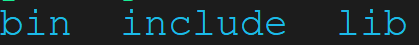
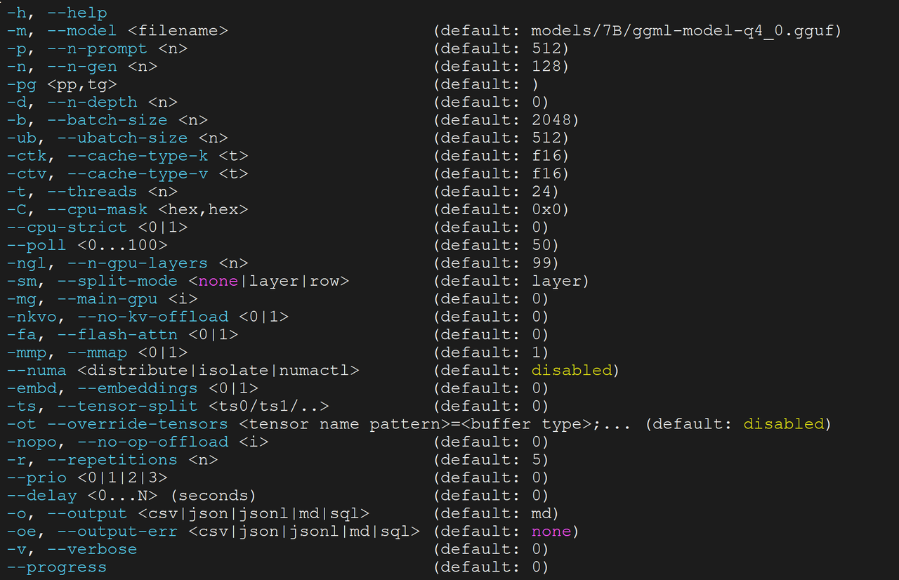
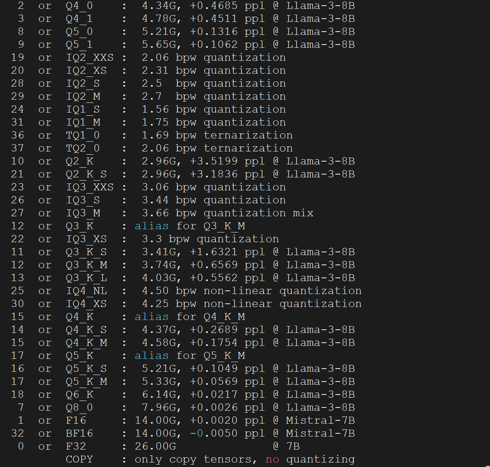

sidebar_position: 1

# 简介

本赛题需要基于进迭开源的llamacpp进行部署，本工程额外增加了对进迭时空AI扩展指令的支持。并针对K1芯片做了很多调优。其架构如下
暂时无法在飞书文档外展示此内容
我们的优化主要在张量计算引起GGML，其他保持了llamacpp源码。

# 编译使用

## 交叉编译

从进迭时空代码仓库拉取代码，切换到进迭时空开发分支，并使用脚本编译即可。详细编译流程如下：

``` shell
# clone 代码
git clone git@github.com:ggml-org/llama.cpp.git

# 编译
参考docs/build-riscv64-spacemit.md，进行工程编译

```

编译完以后，工具和库会被安装到build/installed，其结构如下：

## 关键工具介绍 
| 功能       | 名字           |
|------------|----------------|
| 量化工具   | llama-quantize |
| benchmark工具 | llama-bench |

量化工具使用说明：

量化支持类型：

